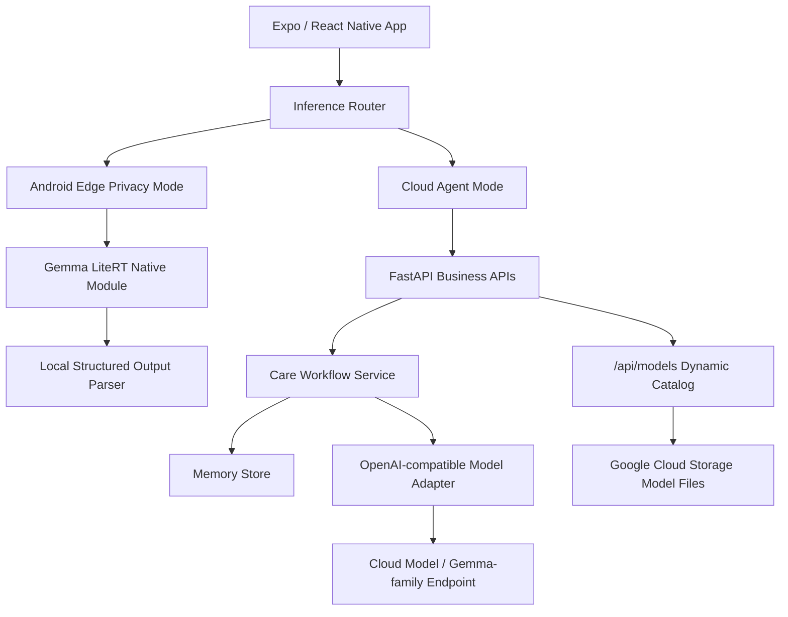

# CareMind 失智症家庭照护 Agent


## TL;DR for Judges

CareMind 是一个面向失智症家庭照护者的 Android Edge AI Care Agent。它把家属零散的照护记录整理成结构化日志、今日行动、沟通话术、照护者支持和复诊摘要，并通过端侧 Gemma LiteRT 模型让敏感记录优先留在本机处理。

**为什么是 C 赛道：**失智症照护里最敏感的信息常常发生在家里和深夜，包括患者状态、家庭压力、用药观察和照护者崩溃时刻。CareMind 的核心 Edge AI 价值是：这些记录不应默认全部上传云端，而应支持在 Android 设备上优先本地理解。

**安全边界：**CareMind 不是医疗器械，不诊断、不处方、不判断检查、不替代医生或急救服务。它只帮助家庭整理照护观察，并准备复诊沟通材料。

## Demo / 评委快速验证

**最短路径：先看视频**

<https://www.bilibili.com/video/BV1hFEg6ZEVb>

<p align="center">
  <a href="https://www.bilibili.com/video/BV1hFEg6ZEVb">
    
  </a>
</p>

**快速路径：直接测试已部署后端**

```bash
curl https://caremind-1039168666325.us-west1.run.app/health
curl https://caremind-1039168666325.us-west1.run.app/api/models
```

完整工作流示例：

```bash
curl -X POST https://caremind-1039168666325.us-west1.run.app/api/care-workflow \
  -H "Content-Type: application/json" \
  -d '{
    "patient_id": "demo_patient",
    "caregiver_id": "demo_caregiver",
    "note": "外婆夜里醒了四次，一直说有人偷钱，晚饭只吃了几口，妈妈也很累。",
    "source": "judge_demo",
    "timezone": "Asia/Shanghai"
  }'
```

预期可以看到结构化照护字段、今日关注事项、照护沟通建议和非诊断性下一步提示。

**完整路径：Android Edge AI 演示**

```text
Android App -> Settings / Privacy Mode -> 刷新模型目录 -> 下载 Gemma LiteRT 模型
-> 关闭网络 -> 输入敏感照护记录 -> 本机生成非诊断性照护理解与建议
```

## Why CareMind

失智症家庭照护的难点不是只发生在诊室里。家属每天要记住夜间起床、拒药、少食、怀疑东西被偷、反复要回家、情绪激动和自己的疲惫。复诊时，医生需要的是清楚的近期变化，但家属常常只能依靠记忆和碎片聊天记录。

CareMind 的目标不是替医生判断病情，而是帮助家属把这些混乱日常变成可记录、可追踪、可沟通的照护线索。

## What CareMind Does

| Care burden | CareMind output |
|---|---|
| 说不清今天发生了什么 | 结构化照护日志 |
| 不知道今晚先做什么 | 今日关注事项 + 低负担行动 |
| 和患者沟通冲突 | 低冲突沟通话术 |
| 复诊时回忆不清 | 近 7 天 / 30 天复诊摘要 |
| 记录太私密 | Android 端侧隐私模式 |
| 照护者快撑不住 | 压力识别 + 支援提醒 |

产品闭环：

```text
messy caregiver note
-> structured care log
-> daily action
-> communication script
-> caregiver support
-> follow-up summary
-> privacy-aware edge processing
```

核心页面：

- **今日照护**：展示今天值得留意的事、行动三态、陪伴活动和照护者支持。
- **智能记录**：输入或语音记录照护事件，生成结构化日志、家庭观察信号和沟通话术。
- **复诊准备**：聚合近 7 天 / 30 天记录、病历/检查/用药资料，生成可复制复诊摘要。

## Why Edge AI

CareMind 选择 C 赛道不是因为“端侧更酷”，而是因为产品场景本身需要隐私优先。

Edge AI 证据：

- Android 真机路径：`frontend/android/app/src/main/java/com/caremind/app/gemma`
- 端侧模型：Gemma-family LiteRT `.litertlm` / `.task`
- 当前演示默认模型：`Gemma3-1B-IT_multi-prefill-seq_q4_ekv4096.litertlm`
- 推理桥接：Android Kotlin native module + `frontend/lib/inference/local`
- 模型目录：App 调用 `GET /api/models`，Cloud Run 动态扫描 Google Cloud Storage
- 隐私路由：`frontend/lib/inference/inference-router.ts` 根据模式选择本地或云端
- 离线演示：下载模型后可关闭 Wi-Fi / 移动网络，演示本地照护理解

### 模型使用说明

| 场景 | 模型 / 路径 | 状态 | 作用 |
|---|---|---|---|
| Android 端侧隐私模式 | Gemma 3 1B LiteRT `.litertlm` | Demo-ready | 敏感照护记录本地理解与建议生成 |
| Android 端侧更大候选 | Gemma 4 E2B / E4B LiteRT | Supported path / experimental | 通过动态模型目录支持，真机稳定性取决于设备内存 |
| 云端 Agent 工作流 | OpenAI-compatible / Gemma-family endpoint | Done | 完整工作流、摘要、工具调用 |
| 稳定性兜底 | deterministic parser / fallback builders | Done | 保证 Demo 不因小模型输出不完整而中断 |

不要混淆：当前真机端侧演示默认使用 Gemma 3 1B LiteRT；Gemma 4 E2B/E4B 是已预留动态目录支持的更大候选模型，不作为普通手机上的默认稳定模型承诺。

## Architecture



核心接口：

```http
POST /api/care-workflow
POST /api/reports/follow-up
POST /api/guardrail/check
GET  /api/models
GET  /api/models/{filename}
POST /v1/chat/completions
```

## Capability Status

| Capability | Status |
|---|---|
| Cloud Run backend | Done |
| `/api/care-workflow` | Done |
| `/api/reports/follow-up` | Done |
| `/api/models` dynamic catalog | Done |
| Android native Gemma bridge | Demo-ready |
| Gemma 3 1B LiteRT Android privacy mode | Demo-ready |
| Gemma 4 E2B/E4B Android model path | Supported path / experimental |
| Fully offline Android inference | Demo-ready / experimental |
| Cloud Agent Tool Calling | Done |
| Doctor collaboration portal | Future |
| Clinical validation | Not in scope |

## Run Instructions

### Recommended for judges

1. Watch the demo video.
2. Test the deployed backend with the sample request above.
3. Review the Android Edge AI code paths.
4. Read the technical highlights and safety boundary.

### Local Web frontend

```bash
git clone https://github.com/hyczy0809/CareMind.git
cd CareMind/frontend
npm install
EXPO_PUBLIC_CAREMIND_API_URL=https://caremind-1039168666325.us-west1.run.app npm run web -- --port 8082
```

Open:

```text
http://127.0.0.1:8082
```

### Local backend + frontend

```bash
git clone https://github.com/hyczy0809/CareMind.git
cd CareMind
pip install -r requirements.txt
cp .env.example .env
uvicorn main:app --host 127.0.0.1 --port 8090
```

Then:

```bash
cd frontend
npm install
EXPO_PUBLIC_CAREMIND_API_URL=http://127.0.0.1:8090 npm run web -- --port 8082
```

### Android Edge AI demo

```bash
cd frontend/android
NODE_ENV=production \
EXPO_PUBLIC_CAREMIND_API_URL=https://caremind-1039168666325.us-west1.run.app \
./gradlew :app:assembleRelease
```

USB debugging path:

```bash
adb reverse tcp:8090 tcp:8090
cd frontend
npm run android:usb
```

### Docker backend

```bash
docker build -t caremind-backend .
docker run --rm -p 8080:8080 --env-file .env caremind-backend
curl http://127.0.0.1:8080/health
```

### Environment

```env
CF_AIG_TOKEN=your-cloudflare-ai-gateway-token
CF_AIG_BASE_URL=https://gateway.ai.cloudflare.com/v1/<account>/<gateway>/compat
MODEL_NAME=google-ai-studio/gemini-2.5-flash
PROMPT_MODE=WEAK
PORT=8080
CAREMIND_GCS_MODEL_BUCKET=caremind-498713-models
CAREMIND_GCS_MODEL_PREFIX=models
CAREMIND_GCS_DYNAMIC_CATALOG=1
CAREMIND_GCS_MODEL_DELIVERY=redirect
```

真实 API Key 只应写入本地 `.env`，不要提交到公开仓库。

## Technical Highlights

1. **Android Edge AI privacy mode**
   Code: [frontend/android/app/src/main/java/com/caremind/app/gemma](frontend/android/app/src/main/java/com/caremind/app/gemma)

2. **Local / cloud inference router**
   Code: [frontend/lib/inference/inference-router.ts](frontend/lib/inference/inference-router.ts)

3. **Dynamic model catalog**
   Code: [frontend/lib/inference/local/model-catalog.ts](frontend/lib/inference/local/model-catalog.ts), [main.py](main.py)

4. **Cloud Agent Tool Calling**
   Code: [my_agent/cloud_agents.py](my_agent/cloud_agents.py), [my_agent/cloudflare_openai_model.py](my_agent/cloudflare_openai_model.py)

5. **Structured product data instead of chat-only output**
   Code: [frontend/lib/inference/local/xml-parsers.ts](frontend/lib/inference/local/xml-parsers.ts), [my_agent/care_workflow_service.py](my_agent/care_workflow_service.py)

## Safety & Privacy

- CareMind 不是医疗器械。
- 不诊断失智症进展。
- 不处方，不建议开始、停止、加减或更换药物。
- 不判断是否需要 MRI、CT、PET、血液检查或认知量表。
- 不替代医生、急救服务或线下专业支持。
- 病历、检查、用药资料进入复诊摘要前，需要家属确认。
- 涉及走失、自伤、伤人、急性意识改变、严重受伤等场景时，应联系当地紧急服务或医生。
- 仓库只包含脱敏演示数据，不包含真实患者、家庭、医院、账号或生产系统数据。
- 大模型文件应通过 Google Cloud Storage 或 Git LFS 管理，不应作为普通 Git blob 提交。

## Deliverables

| Deliverable | Link |
|---|---|
| Project repo | <https://github.com/hyczy0809/CareMind> |
| Competition PR | <https://github.com/gdgshanghai/Gemma4-Hackathon-ShangHai/pull/57> |
| Demo video | <https://www.bilibili.com/video/BV1hFEg6ZEVb> |
| Cloud Run backend | <https://caremind-1039168666325.us-west1.run.app> |
| PRD | [docs/PRD.md](docs/PRD.md) |
| Frontend guide | [frontend/README.md](frontend/README.md) |
| Demo storyboard | [docs/demo-video/demo_storyboard.md](docs/demo-video/demo_storyboard.md) |
| Recording guide | [docs/demo-video/recording_guide.md](docs/demo-video/recording_guide.md) |
| Backend entry | [main.py](main.py) |
| OpenAI-compatible Agent route | [openai_compat.py](openai_compat.py) |
| Agent / Memory workflow | [my_agent](my_agent) |
| Android Gemma bridge | [frontend/android/app/src/main/java/com/caremind/app/gemma](frontend/android/app/src/main/java/com/caremind/app/gemma) |
| Local / cloud inference router | [frontend/lib/inference](frontend/lib/inference) |

## Repository Structure

```text
CareMind/
├── frontend/                       # Expo / React Native frontend
│   ├── app/                        # Expo Router tabs
│   ├── components/                 # Today, Smart Log, Follow-up, settings UI
│   ├── lib/
│   │   ├── inference/              # Cloud / local inference router
│   │   └── speech/                 # Android system speech bridge
│   └── android/                    # Android native project and Gemma bridge
├── docs/
│   ├── PRD.md
│   └── demo-video/
├── my_agent/
│   ├── care_workflow_service.py
│   ├── memory_*.py
│   └── memory_store/
├── main.py                         # FastAPI app
├── openai_compat.py                # OpenAI-compatible Agent endpoint
├── requirements.txt
├── Dockerfile
└── README.md
```

## License

This project is released under the [MIT License](LICENSE).

## Acknowledgments

CareMind 的安全边界参考了公开失智症照护指南和照护者支持资料，包括 NICE dementia recommendations、Mayo Clinic diagnosis education 和 Alzheimer's Association caregiver stress materials。这些资料用于帮助产品保持边界清晰，不意味着 CareMind 是医疗器械或临床决策系统。
