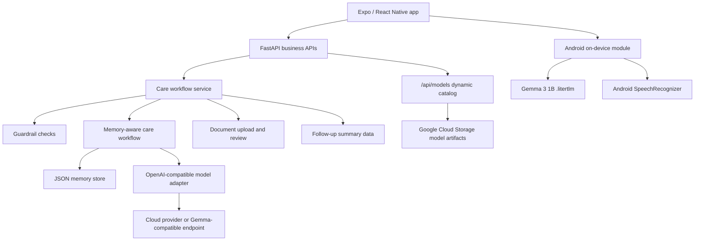

# CareMind


CareMind 是一款面向失智症家庭照护者的 AI 照护导航 Agent。它帮助家属把混乱、零散、情绪化的日常照护记录，整理成结构化日志、今晚可执行的小行动、低冲突沟通话术和可复制的复诊摘要。

CareMind 不诊断、不处方、不判断是否需要检查，也不替代医生或急救服务。它的定位是：**帮助家庭更清楚地记录、理解、沟通和准备复诊**。

CareMind Team：张媛、连婕妤、刘畅、郭鸿宇

## 评审快速入口

| 想快速确认 | 入口 |
|---|---|
| 公开视频 | [Bilibili BV1hFEg6ZEVb](https://www.bilibili.com/video/BV1hFEg6ZEVb) |
| 在线后端 | [https://caremind-1039168666325.us-west1.run.app](https://caremind-1039168666325.us-west1.run.app) |
| PRD | [docs/PRD.md](docs/PRD.md) |
| 前端说明 | [frontend/README.md](frontend/README.md) |
| Demo 录制说明 | [docs/demo-video/recording_guide.md](docs/demo-video/recording_guide.md) |
| 端侧模型核心代码 | [frontend/android/app/src/main/java/com/caremind/app/gemma](frontend/android/app/src/main/java/com/caremind/app/gemma) |
| 本地 / 云端推理路由 | [frontend/lib/inference](frontend/lib/inference) |
| 后端 Agent 工作流 | [my_agent](my_agent) |

建议先看 1 分钟视频，再阅读下面的 Edge AI、启动方式和安全边界。视频文件不放入 Git 历史，README 使用可点击封面图链接到公开视频。

## Demo

<p align="center">
  <a href="https://www.bilibili.com/video/BV1hFEg6ZEVb">
    
  </a>
</p>

Demo 相关文件：

- 公开视频：[Bilibili BV1hFEg6ZEVb](https://www.bilibili.com/video/BV1hFEg6ZEVb)
- 视频封面：[docs/demo-video/generated/caremind-demo-video-preview.png](docs/demo-video/generated/caremind-demo-video-preview.png)
- 分镜脚本：[docs/demo-video/demo_storyboard.md](docs/demo-video/demo_storyboard.md)
- 录制指南：[docs/demo-video/recording_guide.md](docs/demo-video/recording_guide.md)

Demo 核心输入：

```text
妈妈昨晚起来四次，今天一直说有人偷她的钱，晚饭只吃了几口。我也快撑不住了。
```

CareMind 会整理出：

- 睡眠：夜间起床 4 次
- 行为：反复表达“有人偷钱”
- 饮食：晚饭摄入偏少
- 照护者：出现高压力信号
- 今晚行动：开夜灯、确认门锁、记录饮食饮水、必要时请家人轮替
- 沟通话术：不建议说“没人偷，你别乱想”；可尝试“你是不是很担心？我陪你一起找找。”
- 复诊准备：生成医生问题清单、资料清单和可复制摘要

## 阅读路径

| 如果你想确认 | 建议阅读 |
|---|---|
| 产品到底解决什么问题 | [项目定位](#项目定位)、[核心功能](#核心功能) |
| C 赛道 / Edge AI 怎么体现 | [Gemma 使用方式](#gemma-使用方式)、[Edge AI 硬件演示](#edge-ai-硬件演示) |
| 端侧模型如何下载和切换 | [动态端侧模型目录](#动态端侧模型目录)、[Android APK 说明](#android-apk-说明) |
| 后端如何启动 | [快速启动](#快速启动)、[Docker 启动](#docker-启动) |
| 是否有 Tool Calling | [Native Function Calling / Tool Calling](#native-function-calling--tool-calling) |
| 医疗边界是否清楚 | [安全边界](#安全边界) |

## 目录

- [项目定位](#项目定位)
- [Gemma 使用方式](#gemma-使用方式)
- [Edge AI 硬件演示](#edge-ai-硬件演示)
- [产品页面](#产品页面)
- [核心功能](#核心功能)
- [技术栈](#技术栈)
- [快速启动](#快速启动)
- [配置](#配置)
- [Android APK 说明](#android-apk-说明)
- [API 示例](#api-示例)
- [架构](#架构)
- [项目结构](#项目结构)
- [安全边界](#安全边界)
- [贡献](#贡献)

## 项目定位

CareMind 面向在家照护失智症亲人的家庭成员，包括子女、配偶和其他主要照护者。

这类用户通常很累、经常被打断，也很难在复诊时准确回忆过去一周发生了什么。因此 CareMind 不做复杂仪表盘，而是围绕一个简单闭环设计：

```text
写下或说出一件照护事件
-> CareMind 整理成结构化记录
-> 今日照护显示今晚最值得关注的事
-> 复诊准备把记录整理成医生能快速理解的材料
```

## Gemma 使用方式

CareMind 把 Gemma 作为应用层模型能力，而不是硬编码依赖。

当前 Android MVP 中：

- **Gemma 3 1B** 是推荐的隐私模式演示模型，体积约 557 MB，更适合普通 Android 手机，用于端侧照护文本理解和建议生成。
- **Gemma 4 E2B / E4B** 作为较大模型实验保留，但不是默认选项，因为它们在不少真机上更容易出现内存压力或闪退。
- **云端模式** 通过 OpenAI-compatible API 路由运行完整 Agent 工作流和知识增强回复。
- **云端 Agent Tool Calling** 使用 Google ADK agents 和 OpenAI-compatible model adapter 实现。`my_agent/cloud_agents.py` 注册照护、风险、Memory 和摘要工具，`my_agent/cloudflare_openai_model.py` 将函数声明转换成 `tools` / `tool_choice: auto` 请求，并把模型返回的 `tool_calls` 映射回 ADK function calls。
- **语音输入** 当前使用 Android 系统语音识别，把语音转成可编辑文本后再进入 CareMind 工作流。本地 Gemma 音频转写暂时关闭，等待原生音频链路稳定。
- APK 的模型列表来自 `GET /api/models`。Cloud Run 后端会动态扫描 Google Cloud Storage，所以新增端侧模型不需要重新打包 APK。
- 模型文件应放在 Google Cloud Storage 或 Git LFS 中，不应作为普通 Git 文件提交。

这套设计让 CareMind 同时展示：

```text
云端 Agent：完整工作流、工具调用、复诊摘要
端侧模式：敏感照护记录尽量留在手机本地处理
```

### Native Function Calling / Tool Calling

CareMind 的 C 赛道主线是 Android Edge AI。Native Function Calling / Tool Calling 展示在可选云端 Agent 路径中，而不是离线 LiteRT 路径中。

云端 root agent 可以调用：

- `run_cloud_care_workflow`
- `extract_care_signals`
- `assess_patient_risk`
- `assess_caregiver_burden`
- `create_care_plan`
- `retrieve_patient_profile`
- `retrieve_recent_events`
- `generate_doctor_summary`

最小请求：

```bash
curl -X POST http://127.0.0.1:8080/v1/chat/completions \
  -H "Content-Type: application/json" \
  -H "X-Session-ID: demo-session" \
  -d '{
    "model": "my_agent",
    "messages": [
      {
        "role": "user",
        "content": "妈妈昨晚起来四次，一直说有人偷钱，晚饭只吃了几口。我也快撑不住了。"
      }
    ],
    "stream": false
  }'
```

## Edge AI 硬件演示

CareMind 的 Track C / Edge AI 故事是 Android 隐私模式：

```text
手机上的照护记录
-> Android 加载 Gemma 3 1B LiteRT 模型
-> 在本机做照护文本理解和建议生成
-> 敏感记录不需要发送到云端模型
```

### 真机演示步骤

1. 在 Android 真机打开 CareMind。
2. 进入 Settings / Privacy Mode。
3. 展示 `Gemma 3 1B` 已可下载或已加载。
4. 关闭 Wi-Fi 和移动数据。
5. 输入：

```text
外婆夜里醒了四次，一直说有人偷钱，晚饭只吃了几口，妈妈也很累。
```

6. 展示 CareMind 在本机返回非诊断性照护观察和低负担下一步建议。

建议视频字幕：

```text
Network off. Gemma LiteRT runs on the Android device for local care-note understanding.
```

### 模型分发

推荐给队友测试的方式：

```bash
gcloud storage cp ./Gemma3-1B-IT_multi-prefill-seq_q4_ekv4096.litertlm gs://caremind-498713-models-asia/models/
```

然后在 App 内：

```text
Settings -> Privacy Mode -> 刷新 -> Download Gemma 3 1B
```

后端提供稳定下载路径：

```http
GET /api/models/Gemma3-1B-IT_multi-prefill-seq_q4_ekv4096.litertlm
```

Cloud Run 会将大模型文件重定向到 Google Cloud Storage，避免 Cloud Run 直接返回 500 MB+ 文件带来的限制。

可选手动路径：

```bash
adb push Gemma3-1B-IT_multi-prefill-seq_q4_ekv4096.litertlm /sdcard/Android/data/com.caremind.app/files/models/
```

当前本地模型：

```text
Gemma3-1B-IT_multi-prefill-seq_q4_ekv4096.litertlm
Size: about 557 MB
Runtime target: Android / Google AI Edge LiteRT
Mode: optional privacy mode, not required for cloud mode
```

如需放入 GitHub，必须用 Git LFS：

```bash
git lfs install
git lfs track "*.litertlm"
git lfs track "*.task"
git add .gitattributes Gemma3-1B-IT_multi-prefill-seq_q4_ekv4096.litertlm
git commit -m "Add Gemma LiteRT model artifact via Git LFS"
git push
```

## 产品页面

| 页面 | 目标 | 用户输入 | 系统返回 |
|---|---|---|---|
| 今日照护 | 每天打开后的落脚点 | 查看今日状态，标记行动为做到 / 做不到 / 稍后 | 今日关注卡、陪伴活动、照护者支持 |
| 智能记录 | 核心 AI 工作流 | 输入或说出发生了什么 | 结构化日志、风险信号、沟通话术、Memory 候选 |
| 复诊准备 | 医疗沟通辅助 | 选择 7 天 / 30 天，确认资料 | 复诊摘要、医生问题清单、可复制文字 |

## 核心功能

- **智能记录**：从自然语言中抽取睡眠、行为、用药、饮食、安全和照护者压力字段。
- **今日关注**：只突出今晚最值得关注的一两件事，避免把照护者推入更长清单。
- **行动闭环**：支持 `pending / done / blocked`，照护者做不到时也给出替代建议。
- **沟通话术**：为“有人偷钱”“我要回家”等常见场景生成低冲突回应。
- **照护者支持**：识别疲惫、睡眠不足和高压力信号，提醒降低目标和寻求轮替。
- **陪伴活动**：推荐照片、老歌、朗读、分类、轻手工等低风险非医疗活动。
- **资料复诊**：上传或填写病历 / 检查 / 用药摘要，家属确认后进入复诊材料。
- **Memory 工作流**：保存确认过的模式、有效安抚方式和复诊资料。
- **安全边界**：把诊断、用药、检查决策和危机场景导向更安全的回复路径。

## 技术栈

| 层级 | 技术选择 |
|---|---|
| 前端 | Expo, React Native, Expo Router |
| Android 原生 | Kotlin bridge for Gemma model lifecycle and system speech recognition |
| 后端 | FastAPI |
| Agent 路由 | OpenAI-compatible `/v1/chat/completions` |
| 业务 API | Typed `/api/*` endpoints |
| 云端模型适配 | Cloudflare AI Gateway / OpenAI-compatible endpoint |
| 端侧模型 | Gemma 3 1B `.litertlm` via Android native module |
| Memory | JSON-backed MVP memory store |
| 资料管理 | Local upload storage and caregiver review flow |
| 模型分发 | Google Cloud Storage dynamic catalog, optional Git LFS |
| Demo 视频 | HTML canvas storyboard and locally rendered video assets |

## 快速启动

### 环境要求

- Python 3.10+
- Node.js 18+
- npm
- 可选：Cloudflare AI Gateway、OpenAI 或其他 OpenAI-compatible model endpoint

### 1. 启动后端

```bash
pip install -r requirements.txt
cp .env.example .env
uvicorn main:app --host 127.0.0.1 --port 8090
```

健康检查：

```bash
curl http://127.0.0.1:8090/health
```

### 2. 启动前端

```bash
cd frontend
npm install
EXPO_PUBLIC_CAREMIND_API_URL=http://127.0.0.1:8090 npm run web -- --port 8082
```

打开：

```text
http://127.0.0.1:8082
```

### 3. 跑通第一个照护工作流

```bash
curl -X POST http://127.0.0.1:8090/api/care-workflow \
  -H "Content-Type: application/json" \
  -d '{
    "patient_id": "local_patient",
    "caregiver_id": "local_caregiver",
    "note": "妈妈昨晚起来四次，今天一直说有人偷她的钱，晚饭只吃了几口。我也快撑不住了。",
    "source": "manual",
    "timezone": "Asia/Shanghai"
  }'
```

### Docker 启动

```bash
docker build -t caremind-backend .
docker run --rm -p 8080:8080 --env-file .env caremind-backend
curl http://127.0.0.1:8080/health
```

## 配置

从 [.env.example](.env.example) 创建 `.env`。

| 变量 | 是否必需 | 用途 |
|---|---:|---|
| `CF_AIG_TOKEN` | 是，除非使用其他 endpoint | Cloudflare AI Gateway credential |
| `CF_AIG_BASE_URL` | 是，除非使用 `MODEL_BASE_URL` | OpenAI-compatible gateway URL |
| `MODEL_NAME` | 是 | Provider model identifier |
| `MODEL_BASE_URL` | 可选 | Override model endpoint |
| `MODEL_API_KEY` | 可选 | Provider API key when not using `CF_AIG_TOKEN` |
| `TRANSCRIPTION_API_KEY` | 云端 STT 可选 | Speech transcription provider key; falls back to `OPENAI_API_KEY`, `MODEL_API_KEY`, or `CF_AIG_TOKEN` |
| `TRANSCRIPTION_MODEL` | 可选 | Speech transcription model, default `gpt-4o-mini-transcribe` |
| `TRANSCRIPTION_BASE_URL` | 可选 | OpenAI-compatible transcription endpoint, default `https://api.openai.com/v1` |
| `CAREMIND_MODEL_DOWNLOAD_MODE` | 可选 | `proxy` or `stream`; local files are preferred, GCS proxy is used when configured |
| `CAREMIND_REMOTE_MODEL_IDS` | 可选 | Comma-separated remote `.litertlm` model ids |
| `CAREMIND_GCS_MODEL_BUCKET` | 可选 | Cloud Storage bucket used for dynamic on-device model catalog and downloads |
| `CAREMIND_GCS_MODEL_PREFIX` | 可选 | Object prefix for model files, default `models` |
| `CAREMIND_GCS_DYNAMIC_CATALOG` | 可选 | `1` by default; when enabled, Cloud Run scans the GCS prefix |
| `CAREMIND_GCS_MODEL_DELIVERY` | 可选 | `redirect` avoids Cloud Run large-response limits; `proxy` streams through backend |
| `PROMPT_MODE` | 可选 | `WEAK` or `STRONG` prompt mode |
| `PORT` | 可选 | Default `python main.py` port |
| `DRUGBANK_API_KEY` | 可选 | External MCP drug knowledge source |

最小示例：

```env
CF_AIG_TOKEN=your-cloudflare-ai-gateway-token
CF_AIG_BASE_URL=https://gateway.ai.cloudflare.com/v1/<account>/<gateway>/compat
MODEL_NAME=google-ai-studio/gemini-2.5-flash
TRANSCRIPTION_MODEL=gpt-4o-mini-transcribe
PROMPT_MODE=WEAK
PORT=8080
CAREMIND_GCS_MODEL_BUCKET=caremind-498713-models
CAREMIND_GCS_MODEL_PREFIX=models
CAREMIND_GCS_DYNAMIC_CATALOG=1
CAREMIND_GCS_MODEL_DELIVERY=redirect
```

### 动态端侧模型目录

Android APK 不硬编码模型下载列表，而是调用：

```http
GET /api/models
```

当配置 `CAREMIND_GCS_MODEL_BUCKET` 后，Cloud Run 扫描：

```text
gs://<CAREMIND_GCS_MODEL_BUCKET>/<CAREMIND_GCS_MODEL_PREFIX>/
```

每个 `.litertlm` 或 `.task` 文件都会出现在 App 模型列表中，并生成稳定下载路径。新增模型：

```bash
gcloud storage cp ./your-model.litertlm gs://caremind-498713-models-asia/models/
```

用户在隐私模式模型选择器中点击 **刷新** 即可看到新模型，不需要重新打包 APK。

## Android APK 说明

USB 调试时，Android App 可以通过 `adb reverse` 访问电脑本地后端：

```bash
adb reverse tcp:8090 tcp:8090
cd frontend
npm run android:usb
```

正常安装包需要使用已部署的 HTTPS 后端：

```bash
cd frontend
EXPO_PUBLIC_CAREMIND_API_URL=https://api.your-domain.com npm run android:release
```

当前演示后端：

```text
https://caremind-1039168666325.us-west1.run.app
```

示例 release build：

```bash
cd frontend/android
NODE_ENV=production \
EXPO_PUBLIC_CAREMIND_API_URL=https://caremind-1039168666325.us-west1.run.app \
./gradlew :app:assembleRelease
```

### 端侧 LLM 输出格式

Smart Log structuring、medical-boundary guardrail、follow-up summary 等本地推理任务需要小模型输出结构化数据。1B-4B 端侧模型对 **XML tag output** 的稳定性通常高于严格 JSON，因此默认使用 XML。

| 变量 | 默认 | 选项 |
|---|---|---|
| `EXPO_PUBLIC_LOCAL_OUTPUT_FORMAT` | `xml` | `xml` or `json` |

JSON 路径保留为回滚和 A/B 测试选项。两个路径最终都会进入同一套 normalization 和 fallback 逻辑；解析失败时会回退到确定性的 regex builders。详见 [frontend/lib/inference/local/format-config.ts](frontend/lib/inference/local/format-config.ts)。

如果 release APK 构建时缺少 `EXPO_PUBLIC_CAREMIND_API_URL`，CareMind 会 fail closed，显示明确配置错误，而不是错误地访问手机本机 localhost。

## API 示例

### Guardrail Preflight

```bash
curl -X POST http://127.0.0.1:8090/api/guardrail/check \
  -H "Content-Type: application/json" \
  -d '{
    "patient_id": "local_patient",
    "caregiver_id": "local_caregiver",
    "note": "这个药今晚要不要停药？",
    "timezone": "Asia/Shanghai"
  }'
```

### Follow-up Summary With Reviewed Documents

```bash
curl -X POST http://127.0.0.1:8090/api/reports/follow-up \
  -H "Content-Type: application/json" \
  -d '{
    "patient_id": "local_patient",
    "caregiver_id": "local_caregiver",
    "date_range": "7d",
    "record_count": 3,
    "attention_items": [],
    "memory_items": [],
    "followup_documents": [
      {
        "id": "doc_manual_1",
        "type": "medication_list",
        "status": "reviewed",
        "title": "用药清单",
        "summary": "晚饭后服药，近一周 2 次拒药。",
        "confirmed_items": ["用药清单：晚饭后服药，近一周 2 次拒药。"],
        "reviewed_at": "2026-06-05T08:00:00+08:00"
      }
    ],
    "timezone": "Asia/Shanghai"
  }'
```

### Document Upload And Review

```bash
curl -X POST http://127.0.0.1:8090/api/documents/upload \
  -F patient_id=local_patient \
  -F document_type=medication_list \
  -F summary="当前用药清单，晚饭后服药，近期偶尔拒药。" \
  -F file=@/path/to/document.pdf

curl -X POST http://127.0.0.1:8090/api/documents/{document_id}/parse

curl -X POST http://127.0.0.1:8090/api/documents/{document_id}/review \
  -H "Content-Type: application/json" \
  -d '{
    "confirmed_items": [
      "已补充用药清单：当前用药清单，晚饭后服药，近期偶尔拒药。",
      "该资料仅用于复诊沟通整理，影像、量表、诊断和用药结论仍需医生判断。"
    ],
    "family_note": "家属已核对来源。"
  }'
```

### OpenAI-Compatible Agent Route

```bash
curl -X POST http://127.0.0.1:8090/v1/chat/completions \
  -H "Content-Type: application/json" \
  -d '{
    "model": "my_agent",
    "messages": [
      {
        "role": "user",
        "content": "妈妈今天下午一直说要回老家，晚上不肯吃药，半夜起来三次，还想开门出去。我昨天几乎没睡，整个人很烦躁。"
      }
    ],
    "stream": false
  }'
```

## 架构



Agent 职责：

```text
caremind_cloud_root_agent
├── event_structuring_agent
├── patient_risk_agent
├── caregiver_support_agent
├── care_plan_agent
└── doctor_summary_agent
```

## 项目结构

```text
.
├── frontend/
│   ├── app/                         # Expo Router tabs
│   ├── components/                  # Today, Smart Log, Follow-up, settings UI
│   ├── lib/
│   │   ├── inference/               # Cloud / local inference router
│   │   └── speech/                  # Android system speech bridge
│   └── types/
├── docs/
│   ├── PRD.md
│   └── demo-video/
├── my_agent/
│   ├── care_workflow_service.py
│   ├── memory_*.py
│   └── memory_store/
├── main.py                          # FastAPI app
├── openai_compat.py
├── requirements.txt
└── Dockerfile
```

## 文档

- Product PRD: [docs/PRD.md](docs/PRD.md)
- Frontend guide: [frontend/README.md](frontend/README.md)
- Demo recording guide: [docs/demo-video/recording_guide.md](docs/demo-video/recording_guide.md)
- Environment template: [.env.example](.env.example)

## 安全边界

CareMind 坚持保守的医疗边界：

- 不诊断失智症进展。
- 不建议开始、停止、加减或更换药物。
- 不判断是否需要 MRI、CT、PET、血液检查或认知量表。
- 不宣称饮食或活动可以治疗、逆转或改善认知退化。
- 对走失、自伤、伤人、急性意识改变、严重受伤等危机场景，转向紧急支持建议。

病历、检查、用药等医疗相邻资料只用于家庭记录整理和复诊沟通。影像、量表、诊断和用药结论必须由医生判断。

## 贡献

欢迎以下类型的贡献：

- 降低照护者认知负担的 UX 改进。
- 更安全、更温和的医疗边界措辞。
- Guardrail、资料复诊和摘要生成的测试用例。
- 前端可访问性修复。
- 保持 typed schema 的 API 合约改进。

提交 PR 前建议运行：

```bash
cd frontend
npm run typecheck
```

请在 PR 中说明改了什么、如何测试、UI 变更的截图或短录屏，以及是否影响医疗安全边界。

## 许可证

本项目采用 [MIT License](LICENSE)。

## 致谢

CareMind 的安全边界参考了公开失智症照护指南和照护者支持资料，包括 NICE dementia recommendations、Mayo Clinic diagnosis education 和 Alzheimer's Association caregiver stress materials。这些资料用于帮助产品保持边界清晰，不意味着 CareMind 是医疗器械或临床决策系统。
