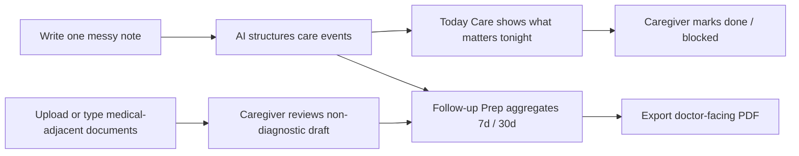
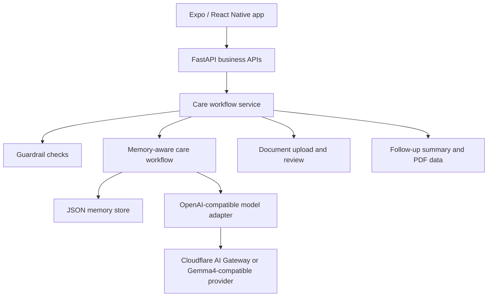

# CareMind


CareMind helps dementia family caregivers turn messy daily care moments into structured logs, safer next actions, follow-up summaries, and doctor-facing PDF materials.

It is a **family care navigation app**, not a diagnosis, prescription, medical-test decision, or emergency-response system.

## Why CareMind

Family dementia care is fragmented. A caregiver may remember that a parent woke up four times, refused dinner, accused someone of stealing money, and that the caregiver barely slept, but those details are often lost before the next clinic visit.

CareMind closes that loop:

```text
Smart Log
-> structured care record
-> Today Care attention cards and action feedback
-> Follow-up Prep summary, reviewed documents, and PDF export
-> Settings event log for demo audit
```

## Visual Demo



Core demo scenarios:

| Scenario | User input | CareMind output |
|---|---|---|
| Daily care log | "Mum woke up four times and barely ate dinner." | Structured log, attention card, tonight actions |
| Communication script | "She keeps saying someone stole her money." | What not to say, what to try, principle |
| Follow-up prep | "Summarize the last week for the doctor." | 7-day summary, doctor questions, materials checklist |
| Caregiver support | "I barely slept and I feel close to breaking down." | Burden signal, lower-goal plan, crisis guardrail if needed |
| Medical document prep | Upload or type a medication list / report note | Non-diagnostic draft, caregiver confirmation, PDF inclusion |

Screen map:

| Tab | What judges should notice in 10 seconds |
|---|---|
| Today Care | One clear patient state, one caregiver check-in, one de-duplicated attention card |
| Smart Log | A messy note becomes structured care events plus a usable communication script |
| Follow-up Prep | Records and reviewed documents become doctor-facing questions, materials, and PDF |

## Table Of Contents

- [Why CareMind](#why-caremind)
- [Visual Demo](#visual-demo)
- [Features](#features)
- [Tech Stack](#tech-stack)
- [Quick Start](#quick-start)
- [Configuration](#configuration)
- [Android APK Backend Binding](#android-apk-backend-binding)
- [Gemma4 Relationship](#gemma4-relationship)
- [API Examples](#api-examples)
- [Architecture](#architecture)
- [Project Layout](#project-layout)
- [Documentation](#documentation)
- [Safety Boundaries](#safety-boundaries)
- [Contributing](#contributing)
- [License](#license)

## Features

- **Smart Log**: turns natural-language care notes into structured sleep, behavior, medication, nutrition, safety, and caregiver fields.
- **Today Care**: shows only the most important attention cards for tonight, with `pending / done / blocked` action states.
- **Attention de-duplication**: repeated nutrition or safety records do not create duplicate cards on the dashboard.
- **Communication scripts**: suggests lower-conflict responses for common dementia care scenarios.
- **Caregiver support**: tracks sleep, mood, support, and personal time; suggests lower-burden actions.
- **Companion activities**: records low-risk, non-medical daily activities and patient responses.
- **Follow-up Prep**: generates 7-day / 30-day summaries, doctor questions, material checklists, and PDFs.
- **Document upload and review**: supports PDF/JPG/PNG/DOCX upload or manual document summaries; only caregiver-reviewed items enter reports.
- **Memory-aware workflow**: preserves confirmed patterns, useful strategies, and follow-up materials.
- **Guardrails**: redirects diagnosis, medication, imaging/test, and crisis requests into safer alternative actions.

## Tech Stack

| Layer | Choice |
|---|---|
| Frontend | Expo, React Native, Expo Router |
| Styling | NativeWind / Tailwind-style utilities, custom UI primitives |
| Backend | FastAPI |
| Agent route | OpenAI-compatible `/v1/chat/completions` |
| Business APIs | Typed `/api/*` endpoints |
| Memory | JSON-backed MVP memory store |
| Documents | Local upload storage for MVP |
| PDF | Frontend export flow |
| Model adapter | Cloudflare AI Gateway / OpenAI-compatible endpoint |

## Quick Start

### Requirements

- Python 3.10+
- Node.js 18+
- npm
- Optional: Cloudflare AI Gateway credentials or another OpenAI-compatible model endpoint

### 1. Start The Backend

```bash
pip install -r requirements.txt
cp .env.example .env
uvicorn main:app --host 127.0.0.1 --port 8090
```

Check health:

```bash
curl http://127.0.0.1:8090/health
```

### 2. Start The Frontend

```bash
cd frontend
npm install
EXPO_PUBLIC_CAREMIND_API_URL=http://127.0.0.1:8090 npm run web -- --port 8082
```

Open:

```text
http://127.0.0.1:8082
```

### 3. Run The First Care Workflow

```bash
curl -X POST http://127.0.0.1:8090/api/care-workflow \
  -H "Content-Type: application/json" \
  -d '{
    "patient_id": "local_patient",
    "caregiver_id": "local_caregiver",
    "note": "妈妈昨晚起来四次，今天一直说有人偷她的钱，晚饭只吃了几口。我也快撑不住了。",
    "source": "manual",
    "timezone": "Asia/Shanghai"
  }'
```

## Configuration

Create `.env` from `.env.example` and adjust these values:

| Variable | Required | Purpose |
|---|---:|---|
| `CF_AIG_TOKEN` | yes, unless using another endpoint | Cloudflare AI Gateway credential |
| `CF_AIG_BASE_URL` | yes, unless using `MODEL_BASE_URL` | OpenAI-compatible gateway URL |
| `MODEL_NAME` | yes | Provider model identifier |
| `MODEL_BASE_URL` | optional | Override model endpoint |
| `MODEL_API_KEY` | optional | Provider API key when not using `CF_AIG_TOKEN` |
| `TRANSCRIPTION_API_KEY` | required for native voice-to-text | Speech transcription provider key; falls back to `OPENAI_API_KEY`, `MODEL_API_KEY`, or `CF_AIG_TOKEN` |
| `TRANSCRIPTION_MODEL` | optional | Speech transcription model, default `gpt-4o-mini-transcribe` |
| `TRANSCRIPTION_BASE_URL` | optional | OpenAI-compatible transcription endpoint, default `https://api.openai.com/v1` |
| `PROMPT_MODE` | optional | `WEAK` or `STRONG` prompt mode |
| `PORT` | optional | Default `python main.py` port |
| `DRUGBANK_API_KEY` | optional | External MCP drug knowledge source |

Minimal example:

```env
CF_AIG_TOKEN=your-cloudflare-ai-gateway-token
CF_AIG_BASE_URL=https://gateway.ai.cloudflare.com/v1/<account>/<gateway>/compat
MODEL_NAME=google-ai-studio/gemini-2.5-flash
TRANSCRIPTION_API_KEY=your-openai-or-compatible-api-key
TRANSCRIPTION_MODEL=gpt-4o-mini-transcribe
PROMPT_MODE=WEAK
PORT=8080
```

## Android APK Backend Binding

For USB debugging, the Android app can still use the laptop backend through `adb reverse`:

```bash
adb reverse tcp:8090 tcp:8090
cd frontend
npm run android:usb
```

For a normal installed APK, do not bind the app to `127.0.0.1`. Build the APK with the deployed HTTPS backend:

```bash
cd frontend
EXPO_PUBLIC_CAREMIND_API_URL=https://api.your-domain.com npm run android:release
```

If a release APK is built without `EXPO_PUBLIC_CAREMIND_API_URL`, CareMind fails closed with a clear configuration error instead of calling the phone's localhost.

## Gemma4 Relationship

CareMind is **not a Gemma4 fork** and does not hard-code product logic into a specific model. CareMind is the application, workflow, memory, guardrail, and UX layer. Gemma4 can be used as the language model behind that layer when exposed through an OpenAI-compatible endpoint.

In a Gemma4-backed setup:

- **Gemma4 handles** language understanding, structured extraction, summarization, and draft generation.
- **CareMind handles** UI flow, typed schemas, memory write gates, document confirmation, medical-boundary guardrails, PDF export, and caregiver-facing interaction design.
- **The adapter handles** model routing through `MODEL_NAME`, `MODEL_BASE_URL`, and `MODEL_API_KEY`.

To switch from the default demo model to Gemma4, use the model identifier provided by your Gemma4-compatible provider:

```env
MODEL_NAME=<provider-gemma4-model-id>
MODEL_BASE_URL=<openai-compatible-endpoint>
MODEL_API_KEY=<provider-api-key>
```

The `/api/*` business endpoints do not change when the model changes.

## API Examples

### Guardrail Preflight

```bash
curl -X POST http://127.0.0.1:8090/api/guardrail/check \
  -H "Content-Type: application/json" \
  -d '{
    "patient_id": "local_patient",
    "caregiver_id": "local_caregiver",
    "note": "这个药今晚要不要停药？",
    "timezone": "Asia/Shanghai"
  }'
```

### Follow-up Summary With Reviewed Documents

```bash
curl -X POST http://127.0.0.1:8090/api/reports/follow-up \
  -H "Content-Type: application/json" \
  -d '{
    "patient_id": "local_patient",
    "caregiver_id": "local_caregiver",
    "date_range": "7d",
    "record_count": 3,
    "attention_items": [],
    "memory_items": [],
    "followup_documents": [
      {
        "id": "doc_manual_1",
        "type": "medication_list",
        "status": "reviewed",
        "title": "用药清单",
        "summary": "晚饭后服药，近一周 2 次拒药。",
        "confirmed_items": ["用药清单：晚饭后服药，近一周 2 次拒药。"],
        "reviewed_at": "2026-06-05T08:00:00+08:00"
      }
    ],
    "timezone": "Asia/Shanghai"
  }'
```

### Document Upload And Review

```bash
curl -X POST http://127.0.0.1:8090/api/documents/upload \
  -F patient_id=local_patient \
  -F document_type=medication_list \
  -F summary="当前用药清单，晚饭后服药，近期偶尔拒药。" \
  -F file=@/path/to/document.pdf

curl -X POST http://127.0.0.1:8090/api/documents/{document_id}/parse

curl -X POST http://127.0.0.1:8090/api/documents/{document_id}/review \
  -H "Content-Type: application/json" \
  -d '{
    "confirmed_items": [
      "已补充用药清单：当前用药清单，晚饭后服药，近期偶尔拒药。",
      "该资料仅用于复诊沟通整理，影像、量表、诊断和用药结论仍需医生判断。"
    ],
    "family_note": "家属已核对来源。"
  }'
```

### OpenAI-Compatible Agent Route

```bash
curl -X POST http://127.0.0.1:8090/v1/chat/completions \
  -H "Content-Type: application/json" \
  -d '{
    "model": "my_agent",
    "messages": [
      {
        "role": "user",
        "content": "妈妈今天下午一直说要回老家，晚上不肯吃药，半夜起来三次，还想开门出去。我昨天几乎没睡，整个人很烦躁。"
      }
    ],
    "stream": false
  }'
```

## Architecture



The agent side can be understood as:

```text
caremind_cloud_root_agent
├── event_structuring_agent
├── patient_risk_agent
├── caregiver_support_agent
├── care_plan_agent
└── doctor_summary_agent
```

## Project Layout

```text
.
├── frontend/
│   ├── app/
│   ├── components/
│   ├── lib/
│   └── types/
├── docs/
│   └── PRD.md
├── main.py
├── openai_compat.py
├── requirements.txt
├── Dockerfile
├── .env.example
└── my_agent/
    ├── agent.py
    ├── care_workflow_schema.py
    ├── care_workflow_service.py
    ├── cloud_agents.py
    ├── cloud_tools.py
    ├── model_config.py
    ├── cloudflare_openai_model.py
    ├── memory_schema.py
    ├── memory_state.py
    ├── memory_tools.py
    ├── memory_router.py
    ├── memory_policy.py
    └── memory_store/
```

## Documentation

- Product PRD: [docs/PRD.md](docs/PRD.md)
- Frontend guide: [frontend/README.md](frontend/README.md)
- Environment template: [.env.example](.env.example)

## Safety Boundaries

CareMind intentionally uses conservative language and workflow constraints:

- It does not diagnose dementia progression.
- It does not suggest starting, stopping, changing, or replacing medication.
- It does not decide whether MRI, CT, PET, blood tests, or cognitive scales are needed.
- It does not claim that diet or activities treat, reverse, or improve cognitive decline.
- Crisis inputs such as missing person, self-harm, harm to others, acute confusion, or serious injury are routed to urgent support guidance.

Medical-adjacent document handling is limited to **family record organization and follow-up communication**. Imaging, scales, diagnosis, and medication conclusions must be judged by clinicians.

## Contributing

Contributions are welcome, especially:

- UX improvements for caregiver clarity and lower cognitive load.
- Safer medical-boundary wording.
- Test cases for guardrails, document review, and follow-up summary generation.
- Frontend accessibility fixes.
- API contract improvements that preserve typed schemas.

Before opening a pull request:

```bash
cd frontend
npm run typecheck
```

Also include:

- What changed.
- How you tested it.
- Screenshots or a short screen recording for UI changes.
- Any safety-boundary impact.

## License

This project is released under the [MIT License](LICENSE).

## Acknowledgments

CareMind's safety framing is informed by public dementia care guidance and caregiver-support resources, including NICE dementia recommendations, Mayo Clinic diagnosis education, and Alzheimer's Association caregiver stress materials. These sources guide product boundaries; they do not make CareMind a medical device or clinical decision system.
