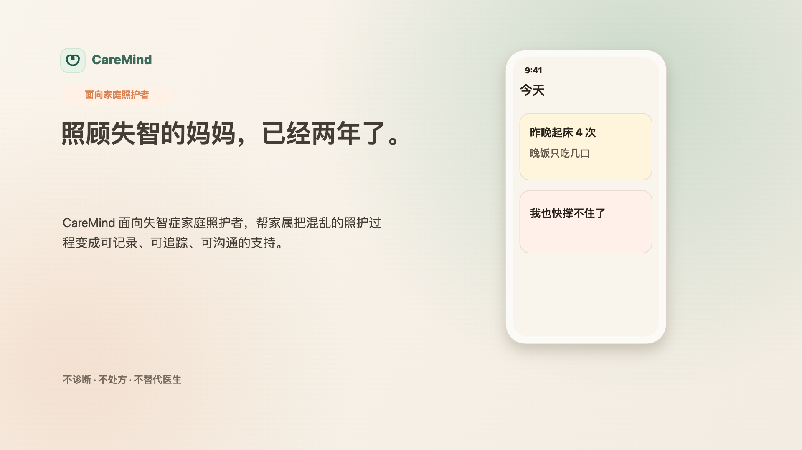
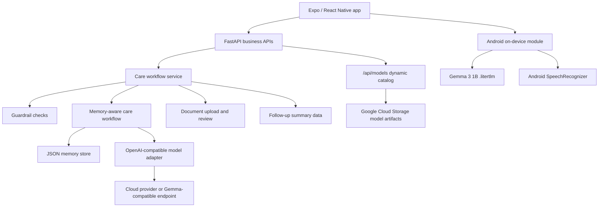

# CareMind


CareMind is a dementia family-care navigation app that helps caregivers turn messy daily care moments into structured logs, safer next actions, communication scripts, and copyable follow-up summaries.

It is built for family caregivers, not clinicians. CareMind does not diagnose, prescribe, decide medical tests, or replace emergency help.

## At A Glance

| What it does | Why it matters |
|---|---|
| Turns one messy note into structured care signals | Caregivers do not need to remember every detail under stress |
| Shows only the most important care actions for tonight | The product reduces decision load instead of adding another checklist |
| Produces lower-conflict communication scripts | Families get words to use in difficult moments |
| Aggregates reviewed records into follow-up summaries | Clinic visits become less dependent on memory alone |
| Supports a privacy mode with Gemma 3 1B on device | Sensitive care context can stay closer to the phone |

## Contents

- [Demo](#demo)
- [Who It Is For](#who-it-is-for)
- [How Gemma Is Used](#how-gemma-is-used)
- [Edge AI Hardware Demo](#edge-ai-hardware-demo)
- [Product Surface](#product-surface)
- [Core Features](#core-features)
- [Tech Stack](#tech-stack)
- [Quick Start](#quick-start)
- [Configuration](#configuration)
- [Android APK Notes](#android-apk-notes)
- [API Examples](#api-examples)
- [Architecture](#architecture)
- [Project Layout](#project-layout)
- [Safety Boundaries](#safety-boundaries)

## Demo

<p align="center">
  
</p>

Demo assets kept in Git:

- Preview image: [docs/demo-video/generated/caremind-demo-video-preview.png](docs/demo-video/generated/caremind-demo-video-preview.png)
- Storyboard: [docs/demo-video/demo_storyboard.md](docs/demo-video/demo_storyboard.md)
- Recording guide: [docs/demo-video/recording_guide.md](docs/demo-video/recording_guide.md)

Rendered video files and browser-generated HTML are intentionally not tracked in normal Git history. Regenerate them locally when preparing a pitch or social video.

Core demo input:

```text
妈妈昨晚起来四次，今天一直说有人偷她的钱，晚饭只吃了几口。我也快撑不住了。
```

CareMind turns this into:

- Sleep: night waking x4
- Behavior: repeated suspicion / "someone stole money"
- Nutrition: low dinner intake
- Caregiver: high burden signal
- Tonight actions: night light, clear walkway, record food and water, ask for help when possible
- Script: do not say "没人偷，你别乱想"; try "你是不是很担心？我陪你一起找找。"
- Follow-up: doctor questions, materials checklist, and copyable summary

## Who It Is For

CareMind is designed for people caring for a loved one with dementia at home: adult children, spouses, and other family caregivers.

The primary user is often tired, interrupted, and emotionally overloaded. The product therefore avoids dense dashboards and long forms. The core interaction is intentionally simple:

```text
Write or speak one care moment
-> CareMind structures it
-> Today Care shows what matters tonight
-> Follow-up Prep turns records into doctor-facing copy
```

## How Gemma Is Used

CareMind uses Gemma as an application-layer model option, not as a hard-coded product dependency.

In the current Android MVP:

- **Gemma 3 1B** is the recommended privacy-mode model for the hardware demo. It is small enough for ordinary Android phones and is used for on-device care-note understanding and suggestion generation.
- **Gemma 4 E2B / E4B** remain optional larger experiments, but they are not the default because they can exceed memory limits and crash on many real phones.
- **Cloud mode** uses an OpenAI-compatible API route for the full agent workflow and knowledge-backed responses.
- **Voice input** currently uses Android system speech recognition to turn speech into editable text. Local Gemma audio transcription is feature-flagged off until the native audio path is stable.
- The Edge AI demo model currently served by the backend is `Gemma3-1B-IT_multi-prefill-seq_q4_ekv4096.litertlm` (`.litertlm`, about 557 MB).
- The APK loads its downloadable model list from `GET /api/models`; the Cloud Run backend scans Google Cloud Storage dynamically, so adding a new model does not require rebuilding the APK.
- Model files should live in Google Cloud Storage or Git LFS, not normal Git history.

This split lets CareMind demonstrate both a practical cloud Agent workflow and a privacy-oriented on-device path for sensitive family-care data.

## Edge AI Hardware Demo

CareMind's Track C / Edge AI story is the Android privacy mode:

```text
Care note on phone
-> Gemma 3 1B LiteRT model loaded on Android device
-> local care-note understanding and suggestion generation
-> no cloud model call for the sensitive note
```

### Demo Hardware

The hardware demo can be recorded on a real Android phone.

Recommended recording checklist:

1. Open CareMind on the Android device.
2. Enter Settings / Privacy Mode.
3. Show `Gemma 3 1B` as available or loaded.
4. Turn off Wi-Fi and mobile data.
5. Enter a care note such as:

```text
外婆夜里醒了四次，一直说有人偷钱，晚饭只吃了几口，妈妈也很累。
```

6. Show CareMind returning local, non-diagnostic care observations and lower-burden next actions.

Suggested video caption:

```text
Network off. Gemma LiteRT runs on the Android device for local care-note understanding.
```

### Model Distribution

Preferred path for teammate testing:

```bash
gcloud storage cp ./Gemma3-1B-IT_multi-prefill-seq_q4_ekv4096.litertlm gs://caremind-498713-models-asia/models/
```

Then open the app:

```text
Settings -> Privacy Mode -> 刷新 -> Download Gemma 3 1B
```

The backend exposes a stable download path:

```http
GET /api/models/Gemma3-1B-IT_multi-prefill-seq_q4_ekv4096.litertlm
```

On Cloud Run this returns a redirect to Google Cloud Storage, which avoids Cloud Run large-response limits for 500 MB+ artifacts.

Optional manual hardware-demo path:

```bash
adb push Gemma3-1B-IT_multi-prefill-seq_q4_ekv4096.litertlm /sdcard/Android/data/com.caremind.app/files/models/
```

Current local model artifact:

```text
Gemma3-1B-IT_multi-prefill-seq_q4_ekv4096.litertlm
Size: about 557 MB
Runtime target: Android / Google AI Edge LiteRT
Mode: optional privacy mode, not required for cloud mode
```

If the model is stored in GitHub, it must be tracked with Git LFS:

```bash
git lfs install
git lfs track "*.litertlm"
git lfs track "*.task"
git add .gitattributes Gemma3-1B-IT_multi-prefill-seq_q4_ekv4096.litertlm
git commit -m "Add Gemma LiteRT model artifact via Git LFS"
git push
```

Normal Git should not be used for this file because GitHub rejects very large regular Git blobs.

### Scope Boundary

The Edge AI demo focuses on local text understanding and care suggestion generation. Voice input currently uses the Android system speech interface to convert speech into editable text before the model step.

## Product Surface

| Tab | Purpose | What the user does | What CareMind returns |
|---|---|---|---|
| Today Care | Daily landing page | Checks today's state and marks actions as done / blocked | One or two attention cards, companion activity, caregiver check-in |
| Smart Log | Main AI workflow | Writes or speaks what happened | Structured log, risk signals, communication script, memory candidates |
| Follow-up Prep | Clinic preparation | Reviews recent records and uploaded / typed materials | 7d / 30d summary, doctor questions, copyable follow-up text |

## Core Features

- **Smart Log**: extracts sleep, behavior, medication, nutrition, safety, and caregiver-burden fields from natural language.
- **Risk attention cards**: highlights non-diagnostic care risks such as night waking, door-opening, low intake, refusal, or caregiver overload.
- **Action state loop**: tracks `pending / done / blocked` so the dashboard reflects what the caregiver could actually do.
- **Communication scripts**: suggests lower-conflict responses for common dementia-care moments.
- **Caregiver support**: recognizes fatigue and helps lower the day's care goal.
- **Companion activities**: supports low-risk, non-medical activities such as photo recall, music, reading, or simple sorting.
- **Document review**: lets families upload or type medical-adjacent summaries; only caregiver-reviewed items enter follow-up output.
- **Memory-aware workflow**: preserves confirmed patterns, useful strategies, and reviewed materials.
- **Safety guardrails**: redirects diagnosis, medication, imaging/test, and crisis requests into safer alternatives.

## Tech Stack

| Layer | Choice |
|---|---|
| Frontend | Expo, React Native, Expo Router |
| Mobile native | Android Kotlin bridge for Gemma model lifecycle and system speech recognition |
| Backend | FastAPI |
| Agent route | OpenAI-compatible `/v1/chat/completions` |
| Business APIs | Typed `/api/*` endpoints |
| Cloud model adapter | Cloudflare AI Gateway / OpenAI-compatible endpoint |
| On-device model | Gemma 3 1B `.litertlm` via Android native module |
| Memory | JSON-backed MVP memory store |
| Documents | Local upload storage and caregiver review flow |
| Model artifacts | Google Cloud Storage dynamic catalog, optional Git LFS |
| Demo video | HTML canvas storyboard and locally rendered video assets |

## Quick Start

### Requirements

- Python 3.10+
- Node.js 18+
- npm
- Optional: Cloudflare AI Gateway, OpenAI, or another OpenAI-compatible model endpoint

### 1. Start The Backend

```bash
pip install -r requirements.txt
cp .env.example .env
uvicorn main:app --host 127.0.0.1 --port 8090
```

Check health:

```bash
curl http://127.0.0.1:8090/health
```

### 2. Start The Frontend

```bash
cd frontend
npm install
EXPO_PUBLIC_CAREMIND_API_URL=http://127.0.0.1:8090 npm run web -- --port 8082
```

Open:

```text
http://127.0.0.1:8082
```

### 3. Run The First Care Workflow

```bash
curl -X POST http://127.0.0.1:8090/api/care-workflow \
  -H "Content-Type: application/json" \
  -d '{
    "patient_id": "local_patient",
    "caregiver_id": "local_caregiver",
    "note": "妈妈昨晚起来四次，今天一直说有人偷她的钱，晚饭只吃了几口。我也快撑不住了。",
    "source": "manual",
    "timezone": "Asia/Shanghai"
  }'
```

## Configuration

Create `.env` from [.env.example](.env.example).

| Variable | Required | Purpose |
|---|---:|---|
| `CF_AIG_TOKEN` | yes, unless using another endpoint | Cloudflare AI Gateway credential |
| `CF_AIG_BASE_URL` | yes, unless using `MODEL_BASE_URL` | OpenAI-compatible gateway URL |
| `MODEL_NAME` | yes | Provider model identifier |
| `MODEL_BASE_URL` | optional | Override model endpoint |
| `MODEL_API_KEY` | optional | Provider API key when not using `CF_AIG_TOKEN` |
| `TRANSCRIPTION_API_KEY` | optional for cloud STT | Speech transcription provider key; falls back to `OPENAI_API_KEY`, `MODEL_API_KEY`, or `CF_AIG_TOKEN` |
| `TRANSCRIPTION_MODEL` | optional | Speech transcription model, default `gpt-4o-mini-transcribe` |
| `TRANSCRIPTION_BASE_URL` | optional | OpenAI-compatible transcription endpoint, default `https://api.openai.com/v1` |
| `CAREMIND_MODEL_DOWNLOAD_MODE` | optional | `proxy` or `stream`; local files are preferred, GCS proxy is used when configured |
| `CAREMIND_REMOTE_MODEL_IDS` | optional | Comma-separated remote `.litertlm` model ids |
| `CAREMIND_GCS_MODEL_BUCKET` | optional | Cloud Storage bucket used for dynamic on-device model catalog and downloads |
| `CAREMIND_GCS_MODEL_PREFIX` | optional | Object prefix for model files, default `models`; every `.litertlm` / `.task` file under this prefix appears in `/api/models` |
| `CAREMIND_GCS_DYNAMIC_CATALOG` | optional | `1` by default; when enabled, Cloud Run scans the GCS prefix so new models appear without rebuilding the APK |
| `CAREMIND_GCS_MODEL_DELIVERY` | optional | `redirect` avoids Cloud Run large-response limits; `proxy` streams through backend |
| `PROMPT_MODE` | optional | `WEAK` or `STRONG` prompt mode |
| `PORT` | optional | Default `python main.py` port |
| `DRUGBANK_API_KEY` | optional | External MCP drug knowledge source |

Minimal example:

```env
CF_AIG_TOKEN=your-cloudflare-ai-gateway-token
CF_AIG_BASE_URL=https://gateway.ai.cloudflare.com/v1/<account>/<gateway>/compat
MODEL_NAME=google-ai-studio/gemini-2.5-flash
TRANSCRIPTION_MODEL=gpt-4o-mini-transcribe
PROMPT_MODE=WEAK
PORT=8080
CAREMIND_GCS_MODEL_BUCKET=caremind-498713-models
CAREMIND_GCS_MODEL_PREFIX=models
CAREMIND_GCS_DYNAMIC_CATALOG=1
CAREMIND_GCS_MODEL_DELIVERY=redirect
```

### Dynamic On-device Model Catalog

The Android APK does not hard-code the downloadable model list. It calls:

```http
GET /api/models
```

When `CAREMIND_GCS_MODEL_BUCKET` is configured, Cloud Run scans:

```text
gs://<CAREMIND_GCS_MODEL_BUCKET>/<CAREMIND_GCS_MODEL_PREFIX>/
```

Every `.litertlm` or `.task` file directly under that prefix is returned to the app with a stable `/api/models/<filename>` download path. To add a new demo model:

```bash
gcloud storage cp ./your-model.litertlm gs://caremind-498713-models-asia/models/
```

Users can tap **刷新** in the privacy-mode model picker; the backend scans GCS dynamically, so the APK does not need to be rebuilt.

## Android APK Notes

For USB debugging, the Android app can use the laptop backend through `adb reverse`:

```bash
adb reverse tcp:8090 tcp:8090
cd frontend
npm run android:usb
```

For a normal installed APK, build with a deployed HTTPS backend:

```bash
cd frontend
EXPO_PUBLIC_CAREMIND_API_URL=https://api.your-domain.com npm run android:release
```

Current demo backend:

```text
https://caremind-1039168666325.us-west1.run.app
```

Example release build:

```bash
cd frontend/android
NODE_ENV=production \
EXPO_PUBLIC_CAREMIND_API_URL=https://caremind-1039168666325.us-west1.run.app \
./gradlew :app:assembleRelease
```

### On-device LLM output format

Every local-inference task (SmartLog structuring, medical-boundary guardrail, follow-up summary) requires the small model to emit structured data. 1B–4B class on-device models are significantly more reliable with **XML tag output** than with strict JSON syntax. The output format is controlled by an environment variable:

| Var | Default | Options |
|---|---|---|
| `EXPO_PUBLIC_LOCAL_OUTPUT_FORMAT` | `xml` | `xml` or `json` |

The JSON path is retained as a rollback and for format A/B comparison. Both paths converge to the same normalisation and fallback logic; parsing failures in either format fall through to deterministic regex-based builders. See `frontend/lib/inference/local/format-config.ts` for details.

If a release APK is built without `EXPO_PUBLIC_CAREMIND_API_URL`, CareMind fails closed with a clear configuration error instead of calling the phone's localhost.

## API Examples

### Guardrail Preflight

```bash
curl -X POST http://127.0.0.1:8090/api/guardrail/check \
  -H "Content-Type: application/json" \
  -d '{
    "patient_id": "local_patient",
    "caregiver_id": "local_caregiver",
    "note": "这个药今晚要不要停药？",
    "timezone": "Asia/Shanghai"
  }'
```

### Follow-up Summary With Reviewed Documents

```bash
curl -X POST http://127.0.0.1:8090/api/reports/follow-up \
  -H "Content-Type: application/json" \
  -d '{
    "patient_id": "local_patient",
    "caregiver_id": "local_caregiver",
    "date_range": "7d",
    "record_count": 3,
    "attention_items": [],
    "memory_items": [],
    "followup_documents": [
      {
        "id": "doc_manual_1",
        "type": "medication_list",
        "status": "reviewed",
        "title": "用药清单",
        "summary": "晚饭后服药，近一周 2 次拒药。",
        "confirmed_items": ["用药清单：晚饭后服药，近一周 2 次拒药。"],
        "reviewed_at": "2026-06-05T08:00:00+08:00"
      }
    ],
    "timezone": "Asia/Shanghai"
  }'
```

### Document Upload And Review

```bash
curl -X POST http://127.0.0.1:8090/api/documents/upload \
  -F patient_id=local_patient \
  -F document_type=medication_list \
  -F summary="当前用药清单，晚饭后服药，近期偶尔拒药。" \
  -F file=@/path/to/document.pdf

curl -X POST http://127.0.0.1:8090/api/documents/{document_id}/parse

curl -X POST http://127.0.0.1:8090/api/documents/{document_id}/review \
  -H "Content-Type: application/json" \
  -d '{
    "confirmed_items": [
      "已补充用药清单：当前用药清单，晚饭后服药，近期偶尔拒药。",
      "该资料仅用于复诊沟通整理，影像、量表、诊断和用药结论仍需医生判断。"
    ],
    "family_note": "家属已核对来源。"
  }'
```

### OpenAI-Compatible Agent Route

```bash
curl -X POST http://127.0.0.1:8090/v1/chat/completions \
  -H "Content-Type: application/json" \
  -d '{
    "model": "my_agent",
    "messages": [
      {
        "role": "user",
        "content": "妈妈今天下午一直说要回老家，晚上不肯吃药，半夜起来三次，还想开门出去。我昨天几乎没睡，整个人很烦躁。"
      }
    ],
    "stream": false
  }'
```

## Architecture



Agent responsibilities:

```text
caremind_cloud_root_agent
├── event_structuring_agent
├── patient_risk_agent
├── caregiver_support_agent
├── care_plan_agent
└── doctor_summary_agent
```

## Project Layout

```text
.
├── frontend/
│   ├── app/                         # Expo Router tabs
│   ├── components/                  # Today, Smart Log, Follow-up, settings UI
│   ├── lib/
│   │   ├── inference/               # Cloud / local inference router
│   │   └── speech/                  # Android system speech bridge
│   └── types/
├── docs/
│   ├── PRD.md
│   └── demo-video/
├── my_agent/
│   ├── care_workflow_service.py
│   ├── memory_*.py
│   └── memory_store/
├── main.py                          # FastAPI app
├── openai_compat.py
├── requirements.txt
└── Dockerfile
```

## Documentation

- Product PRD: [docs/PRD.md](docs/PRD.md)
- Frontend guide: [frontend/README.md](frontend/README.md)
- Demo recording guide: [docs/demo-video/recording_guide.md](docs/demo-video/recording_guide.md)
- Environment template: [.env.example](.env.example)

## Safety Boundaries

CareMind intentionally uses conservative language and workflow constraints:

- It does not diagnose dementia progression.
- It does not suggest starting, stopping, changing, or replacing medication.
- It does not decide whether MRI, CT, PET, blood tests, or cognitive scales are needed.
- It does not claim that diet or activities treat, reverse, or improve cognitive decline.
- Crisis inputs such as missing person, self-harm, harm to others, acute confusion, or serious injury are routed to urgent support guidance.

Medical-adjacent document handling is limited to family record organization and follow-up communication. Imaging, scales, diagnosis, and medication conclusions must be judged by clinicians.

## Contributing

Contributions are welcome, especially:

- UX improvements that reduce caregiver cognitive load.
- Safer medical-boundary wording.
- Test cases for guardrails, document review, and follow-up summary generation.
- Frontend accessibility fixes.
- API contract improvements that preserve typed schemas.

Before opening a pull request:

```bash
cd frontend
npm run typecheck
```

Please include what changed, how it was tested, screenshots or a short recording for UI changes, and any safety-boundary impact.

## License

This project is released under the [MIT License](LICENSE).

## Acknowledgments

CareMind's safety framing is informed by public dementia care guidance and caregiver-support resources, including NICE dementia recommendations, Mayo Clinic diagnosis education, and Alzheimer's Association caregiver stress materials. These sources guide product boundaries; they do not make CareMind a medical device or clinical decision system.
