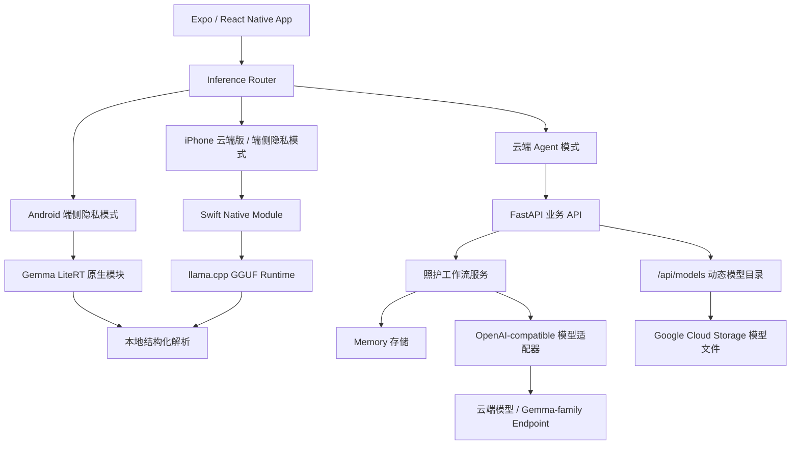

# CareMind 失智症家庭照护 Agent

## 1. 项目名称

正式项目名称：**CareMind 失智症家庭照护 Agent**

参赛赛道：**赛道 C · Edge AI**

项目定位：面向失智症家庭照护者的 AI Care Agent，把家属零散的照护记录整理成结构化日志、今日关注事项、沟通话术、照护者支持和复诊摘要。

当前运行形态：

- **Android 端侧隐私模式**：已支持 Gemma LiteRT 端侧演示，敏感照护记录可优先在本机处理。
- **iPhone 云端 Agent 版**：已支持完整 App 与云端 Agent 工作流。
- **iPhone 端侧隐私模式**：已部署首版 iOS Swift Native Bridge + llama.cpp，可做 GGUF 模型下载、校验、删除和端侧 XML 输出；当前为 CPU / Accelerate 路径，后续继续做 Metal 与更大模型压测。
- **云端 Agent 后端**：已部署到 Google Cloud Run，提供照护工作流、复诊摘要、资料上传和模型目录接口。

安全边界：CareMind 不是医疗器械，不诊断、不处方、不判断检查、不替代医生或急救服务。它只帮助家庭整理照护观察，并准备复诊沟通材料。

## 2. 项目简介

失智症家庭照护的压力大多发生在医院之外。家属需要记住夜间起床、拒药、少食、怀疑东西被偷、反复要回家、情绪激动和自己的疲惫。复诊时，医生需要的是清楚的近期变化，但家属常常只能依靠记忆和零散聊天记录。

CareMind 做的是一条家庭照护闭环：

```text
零散照护记录
-> 结构化照护日志
-> 今日关注事项
-> 低负担行动建议
-> 低冲突沟通话术
-> 照护者支持
-> 近 7 天 / 30 天复诊摘要
-> 隐私优先的端侧处理
```

核心页面：

- **今日照护**：展示今天值得留意的事、行动三态、陪伴活动和照护者支持。
- **智能记录**：输入或语音记录照护事件，生成结构化日志、家庭观察信号和沟通话术。
- **复诊准备**：聚合近 7 天 / 30 天记录、病历/检查/用药资料，生成可复制复诊摘要。
- **隐私模式**：在端侧模型就绪时，优先使用本机模型处理敏感文字记录。

CareMind 的重点不是“AI 总结文本”，而是让照护者在混乱和疲惫时，知道今天先做什么、复诊该说什么，也知道哪些信息应该先留在自己手机里。

## 3. 在线演示链接

演示视频：

<https://www.bilibili.com/video/BV1hFEg6ZEVb>

<p align="center">
  <a href="https://www.bilibili.com/video/BV1hFEg6ZEVb">
    
  </a>
</p>

Cloud Run 后端：

<https://caremind-1039168666325.us-west1.run.app>

后端冒烟测试：

```bash
curl https://caremind-1039168666325.us-west1.run.app/health
curl https://caremind-1039168666325.us-west1.run.app/api/models
```

完整工作流测试：

```bash
curl -X POST https://caremind-1039168666325.us-west1.run.app/api/care-workflow \
  -H "Content-Type: application/json" \
  -d '{
    "patient_id": "demo_patient",
    "caregiver_id": "demo_caregiver",
    "note": "外婆夜里醒了四次，一直说有人偷钱，晚饭只吃了几口，妈妈也很累。",
    "source": "judge_demo",
    "timezone": "Asia/Shanghai"
  }'
```

预期可以看到结构化照护字段、今日关注事项、照护沟通建议和非诊断性下一步提示。

Android 端侧演示路径：

```text
Android App
-> 设置 / 隐私模式
-> 刷新模型目录
-> 下载 Gemma LiteRT 模型
-> 关闭 Wi-Fi 和移动网络
-> 输入敏感照护记录
-> 本机生成非诊断性照护理解与建议
```

iPhone 端验证路径：

```text
iPhone / iOS Simulator
-> Cloud Run 后端
-> 智能记录、今日照护、复诊准备、资料上传、录音上传转写
```

iPhone 端侧验证路径：

```text
iPhone App
-> 设置 / 隐私模式
-> 下载 Gemma 3 1B GGUF 模型
-> 输入敏感照护记录
-> llama.cpp 本机生成非诊断性 XML 输出
```

## 4. 项目仓库链接

主项目仓库：

<https://github.com/hyczy0809/CareMind>

比赛 fork 提交目录：

<https://github.com/whitesungun876/Gemma4-Hackathon-ShangHai/tree/main/submissions/2026/track_C/CareMind>

官方 PR：

<https://github.com/gdgshanghai/Gemma4-Hackathon-ShangHai/pull/64>

## 5. 运行方式

### 方式一：本地 Web 前端连接已部署后端

```bash
git clone https://github.com/hyczy0809/CareMind.git
cd CareMind/frontend
npm install
EXPO_PUBLIC_CAREMIND_API_URL=https://caremind-1039168666325.us-west1.run.app npm run web -- --port 8082
```

浏览器打开：

```text
http://127.0.0.1:8082
```

### 方式二：本地后端 + 前端

```bash
git clone https://github.com/hyczy0809/CareMind.git
cd CareMind
pip install -r requirements.txt
cp .env.example .env
uvicorn main:app --host 127.0.0.1 --port 8090
```

另开终端：

```bash
cd frontend
npm install
EXPO_PUBLIC_CAREMIND_API_URL=http://127.0.0.1:8090 npm run web -- --port 8082
```

### 方式三：iPhone / iOS 云端版

```bash
cd frontend
npm install
EXPO_PUBLIC_CAREMIND_API_URL=https://caremind-1039168666325.us-west1.run.app npm run ios:cloud
```

iOS 模拟器连接本地后端：

```bash
EXPO_PUBLIC_CAREMIND_API_URL=http://127.0.0.1:8090 npm run ios:local
```

EAS 内部分发：

```bash
cd frontend
npm install -g eas-cli
eas login
eas build -p ios --profile preview
```

### 方式四：Android 端侧 AI 演示

```bash
cd frontend
npm install
npm run typecheck
cd android
NODE_ENV=production \
EXPO_PUBLIC_CAREMIND_API_URL=https://caremind-1039168666325.us-west1.run.app \
./gradlew :app:assembleRelease
```

USB 调试本地后端：

```bash
adb reverse tcp:8090 tcp:8090
cd frontend
npm run android:usb
```

### 方式五：Docker 后端

```bash
docker build -t caremind-backend .
docker run --rm -p 8080:8080 --env-file .env caremind-backend
curl http://127.0.0.1:8080/health
```

后端环境变量示例：

```env
CF_AIG_TOKEN=your-cloudflare-ai-gateway-token
CF_AIG_BASE_URL=https://gateway.ai.cloudflare.com/v1/<account>/<gateway>/compat
MODEL_NAME=google-ai-studio/gemini-2.5-flash
PROMPT_MODE=WEAK
PORT=8080
CAREMIND_GCS_MODEL_BUCKET=caremind-498713-models
CAREMIND_GCS_MODEL_PREFIX=models
CAREMIND_GCS_DYNAMIC_CATALOG=1
CAREMIND_GCS_MODEL_DELIVERY=redirect
```

真实 API Key 只应写入本地 `.env`，不要提交到公开仓库。

## 6. 技术栈

| 层级 | 技术选择 |
|---|---|
| 前端 | Expo SDK 52, React Native 0.76, Expo Router, TypeScript |
| 前端 UI | React Native Components, lucide-react-native, expo-blur, expo-haptics, expo-linear-gradient |
| Android 端侧 | Kotlin Native Module, MediaPipe GenAI runtime, Gemma LiteRT `.litertlm` / `.task` |
| iOS 端侧 | Expo Swift Native Module, iOS Model Store, llama.cpp GGUF local engine, CPU / Accelerate runtime |
| 后端 | FastAPI, Uvicorn, Python 3.12 |
| Agent | Google ADK Agent, OpenAI-compatible model adapter, Cloudflare AI Gateway |
| Memory | JSON-backed Memory Store, Memory Router, Memory Policy, Memory Tools |
| 模型分发 | Google Cloud Storage 动态模型目录, `/api/models`, `/api/models/{filename}` |
| 部署 | Google Cloud Run, Docker |

## 7. Agent 与系统架构

### 7.1 总体架构



### 7.2 Agent 架构

CareMind 云端采用 **1 个 Root Orchestrator + 5 个 Specialist Agents**。Memory Router、Memory Update、Knowledge Retrieval 和 Guardrail 是工作流模块，不单独算成对话 Agent。

| Agent | 数量 | 职责 | 代码 |
|---|---:|---|---|
| `caremind_cloud_root_agent` | 1 | 总调度器，判断任务、编排子 Agent、统一输出非诊断性照护建议 | `my_agent/cloud_agents.py` |
| `event_structuring_agent` | 1 | 把自然语言照护记录抽取成结构化事件，并写入 Episodic Memory | `my_agent/cloud_agents.py` |
| `patient_risk_agent` | 1 | 结合近期事件、行为基线和安全规则生成非诊断性今日关注提示 | `my_agent/cloud_agents.py` |
| `caregiver_support_agent` | 1 | 识别照护者睡眠不足、压力和耗竭线索，生成支持建议 | `my_agent/cloud_agents.py` |
| `care_plan_agent` | 1 | 把关注卡片、患者偏好、历史有效方法和知识库转成低负担行动计划 | `my_agent/cloud_agents.py` |
| `doctor_summary_agent` | 1 | 调用长期 Memory 生成近 7 天 / 30 天复诊摘要和问题清单 | `my_agent/cloud_agents.py` |

显式 ADK Agent 一共 **6 个**。

云端工作流：

```text
用户记录
-> Root Orchestrator
-> Event Structuring Agent
-> Memory Router / Knowledge Retrieval
-> Patient Risk Agent
-> Caregiver Support Agent
-> Care Plan Agent
-> Memory Update / Guardrail
-> Doctor Summary Agent
-> 前端结构化展示
```

核心接口：

```http
POST /api/care-workflow
POST /api/reports/follow-up
POST /api/guardrail/check
GET  /api/models
GET  /api/models/{filename}
POST /v1/chat/completions
```

### 7.3 模型使用说明

| 场景 | 模型 / 路径 | 状态 | 作用 |
|---|---|---|---|
| Android 端侧隐私模式 | Gemma 3 1B LiteRT `.litertlm` | 可演示 | 敏感照护记录本地理解与建议生成 |
| Android 端侧更大候选 | Gemma 4 E2B / E4B LiteRT | 已支持路径 / 实验性 | 通过动态模型目录支持，真机稳定性取决于设备内存 |
| iPhone / iOS 云端版 | Cloud Run Agent workflow | 已支持 | 完整 App 体验、资料上传、录音上传转写 |
| iPhone / iOS 端侧隐私模式 | Swift Native Module + llama.cpp GGUF runtime | 已部署首版 / 继续性能压测 | 模型生命周期、下载校验、端侧 XML 输出和本地推理入口 |
| 云端 Agent 工作流 | OpenAI-compatible / Gemma-family endpoint | 已完成 | 完整工作流、摘要、工具调用 |
| 稳定性兜底 | deterministic parser / fallback builders | 已完成 | 保证 Demo 不因小模型输出不完整而中断 |

当前真机端侧演示默认使用 Android Gemma 3 1B LiteRT；iPhone 端侧默认使用 Gemma 3 1B GGUF + llama.cpp CPU / Accelerate runtime。Gemma 4 E2B/E4B 是动态模型目录中预留的更大候选模型，不作为普通手机默认稳定模型承诺；iOS Metal 加速和更大模型作为后续优化方向继续压测。

## 8. 项目亮点

1. **失智症家庭照护专用 Agent，不是通用聊天机器人**
   CareMind 围绕照护日志、今日关注、沟通话术、复诊摘要和照护者压力支持组织输出。

2. **端侧隐私是产品需求，不是装饰性技术点**
   失智症照护记录常常包含家庭压力、患者状态和照护者崩溃时刻。Android 与 iPhone 隐私模式都让敏感文字记录可以优先在本机完成初步理解。

3. **云端多 Agent + Memory 工作流**
   6 个显式 ADK Agent 负责事件结构化、非诊断性关注提示、照护者支持、行动计划和复诊摘要。Memory Router 会调取患者画像、近期事件、行为基线和用药记录。

4. **完整前端 UI 已提交**
   `frontend/app` 和 `frontend/components` 包含今日照护、智能记录、复诊准备、设置页、Memory 提示、资料上传和隐私模式 UI。

5. **Android 与 iPhone 路线都保留**
   Android 用于 C 赛道端侧硬件演示；iPhone 端同时支持云端 Agent 与 llama.cpp 端侧隐私模式，便于覆盖更多真实照护者设备。

6. **医疗边界前置**
   系统不诊断、不处方、不判断检查。复诊摘要和资料进入报告前需要家属确认。

## 9. 交付物说明

| 交付物 | 位置 |
|---|---|
| 项目仓库 | <https://github.com/hyczy0809/CareMind> |
| 比赛 fork 提交目录 | <https://github.com/whitesungun876/Gemma4-Hackathon-ShangHai/tree/main/submissions/2026/track_C/CareMind> |
| 官方 PR | <https://github.com/gdgshanghai/Gemma4-Hackathon-ShangHai/pull/64> |
| 演示视频 | <https://www.bilibili.com/video/BV1hFEg6ZEVb> |
| Cloud Run 后端 | <https://caremind-1039168666325.us-west1.run.app> |
| PRD | `docs/PRD.md` |
| 前端说明 | `frontend/README.md` |
| iPhone 端侧架构 | `docs/ios-edge-architecture.md` |
| iPhone Native Bridge | `frontend/modules/caremind-ios-gemma`, `frontend/ios` |
| Android Gemma bridge | `frontend/android/app/src/main/java/com/caremind/app/gemma` |
| Agent / Memory 工作流 | `my_agent` |
| 本地 / 云端推理路由 | `frontend/lib/inference` |
| Demo 分镜 | `docs/demo-video/demo_storyboard.md` |
| 录制指南 | `docs/demo-video/recording_guide.md` |

## 目录结构

```text
CareMind/
├── frontend/                       # Expo / React Native 前端
│   ├── app/                        # Expo Router 页面和 3 个 Tab
│   ├── components/                 # 今日照护、智能记录、复诊准备、设置页 UI
│   ├── ios/                        # iOS 原生工程
│   ├── modules/caremind-ios-gemma/ # iOS Swift Native Bridge
│   ├── lib/
│   │   ├── inference/              # 云端 / 本地推理路由
│   │   └── speech/                 # Android 系统语音桥接
│   ├── types/                      # 前后端契约类型
│   └── android/                    # Android 原生工程和 Gemma bridge
├── docs/
│   ├── PRD.md
│   ├── ios-edge-architecture.md
│   └── demo-video/
├── my_agent/
│   ├── cloud_agents.py             # 6 个显式 ADK Agent
│   ├── cloud_tools.py              # 云端工作流工具
│   ├── care_workflow_service.py    # typed API adapter
│   ├── memory_*.py                 # Memory schema/router/policy/tools
│   └── memory_store/               # 本地 demo memory 数据
├── main.py                         # FastAPI 应用
├── openai_compat.py                # OpenAI-compatible Agent endpoint
├── requirements.txt
├── Dockerfile
└── README.md
```

## 脱敏与安全声明

- 仓库不包含真实患者、家庭、医院、账号或生产系统数据。
- `.env`、真实 API Key、上传文件、模型权重、APK 和构建产物不作为普通 Git 文件提交。
- 大模型文件应通过 Google Cloud Storage、Release asset 或 Git LFS 管理。
- CareMind 不是医疗器械，不提供诊断、处方、检查决策或急救替代。
- 涉及走失、自伤、伤人、急性意识改变、严重受伤等情况，应联系当地紧急服务或医生。

## 许可证

本项目采用 [MIT License](LICENSE)。
