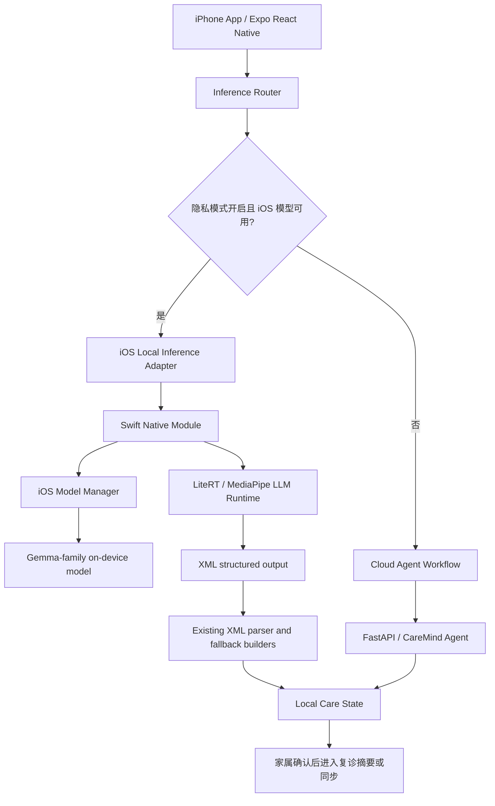

# CareMind iPhone 端侧架构补充

> 状态：架构补充 / 下一阶段实现方案。当前 iPhone 端已经支持完整 App 与云端 Agent 工作流；真正的 iOS 本地大模型推理需要新增 Swift Native Module 后才能作为端侧演示能力声明。

## 1. 为什么需要 iPhone 端侧

CareMind 的目标用户是家庭照护者。很多照护者使用 iPhone 记录深夜发生的照护细节，例如夜间起床、拒药、怀疑东西被偷、家庭成员压力和照护者崩溃时刻。

这些内容有两个特点：

- **高度私密**：原始记录往往包含患者状态、家庭关系、情绪表达和照护者压力。
- **高频碎片化**：照护者常在夜里、通勤或复诊前临时记录一句话。

因此 iPhone 端侧架构的目标不是为了追求技术展示，而是为了让敏感照护记录在条件允许时优先留在用户设备上完成初步理解，再由家属决定是否进入复诊材料或同步到云端。

## 2. 当前版本与目标版本

| 平台 / 模式 | 当前状态 | 目标状态 |
|---|---|---|
| iPhone 云端 Agent | 已支持 | 继续保留，负责完整 Agent 工作流和资料同步 |
| iPhone 端侧文本理解 | 架构已设计 | 接入 Swift Native Module 后启用 |
| Android 端侧隐私模式 | 已可演示 | 继续作为 C 赛道硬件演示主路径 |
| 语音转文字 | 系统语音 / 上传转写 | 先转成可编辑文本，再交给端侧或云端理解 |

不要混淆：iPhone 端侧架构是 CareMind 的后续落地路线；当前已完成的是 iPhone App 云端版与 Android 真机端侧演示。

## 3. 端侧目标闭环

```text
照护者在 iPhone 输入或录音
-> 系统语音能力 / 手动输入转为可编辑文本
-> Inference Router 判断是否可用 iOS 本地模型
-> Swift Native Module 调用本地 Gemma-family 模型
-> 输出 XML 结构化结果
-> 复用现有 XML parser / fallback builder
-> 生成今日关注、沟通话术、复诊摘要草稿
-> 家属确认后才同步或进入报告
```

## 4. 推荐架构



## 5. iOS Native Module 设计

建议新增一个独立的 iOS 推理模块，不把 Swift 逻辑散落在页面组件里。

推荐路径：

```text
frontend/
├── modules/
│   └── caremind-ios-gemma/
│       ├── ios/
│       │   ├── CareMindGemmaModule.swift
│       │   ├── IosGemmaEngine.swift
│       │   └── IosModelStore.swift
│       └── src/
│           └── index.ts
└── lib/inference/local/
    ├── gemma-native.ts
    ├── care-workflow-local.ts
    ├── guardrail-local.ts
    └── followup-local.ts
```

Native Module 对外暴露最小 API：

```ts
type IosGemmaModule = {
  isAvailable(): Promise<boolean>;
  getRuntimeInfo(): Promise<{
    platform: "ios";
    runtime: "litert" | "mediapipe-llm";
    accelerator: "cpu" | "metal" | "coreml";
    loadedModelId?: string;
  }>;
  loadModel(modelPath: string): Promise<void>;
  unloadModel(): Promise<void>;
  generate(prompt: string, options: {
    maxTokens: number;
    temperature: number;
    stop?: string[];
  }): Promise<string>;
};
```

## 6. 模型与运行时选择

iPhone 端侧模型需要单独做兼容性验证，不能直接假设 Android 上可用的 `.litertlm` 文件一定能在 iOS 上稳定运行。

建议顺序：

| 阶段 | 模型选择 | 原因 |
|---|---|---|
| P0 验证 | 官方 iOS 示例明确支持的 Gemma-family 小模型格式 | 先验证 Swift 调用、加载、生成和内存边界 |
| P1 Demo | 低参数量量化模型 | 保证中端 iPhone 不闪退，优先稳定 |
| P2 增强 | Gemma 4 E2B / E4B iOS 候选 | 仅在 iOS runtime 与真机内存测试通过后开放 |

工程原则：

- 模型文件不随普通 Git 提交。
- 大模型通过 Cloud Storage / Release asset / MDM 分发。
- 下载后写入 App 私有目录，并排除 iCloud 备份。
- 每个模型记录 `id / filename / size / checksum / runtime / minDevice / status`。
- 低内存、加载失败或超时必须优雅回退，不允许 App 闪退。

## 7. 隐私路由规则

Inference Router 保持一个统一入口，避免页面知道“当前到底走 iOS 本地、Android 本地还是云端”。

```text
if privacyMode && platform == android && androidGemmaReady:
    run Android local Gemma
else if privacyMode && platform == ios && iosGemmaReady:
    run iOS local Gemma
else if userAllowedCloud:
    run cloud Agent workflow
else:
    run deterministic safe fallback
```

关键点：

- 隐私模式开启时，如果本地模型不可用，不能静默上传云端。
- 需要明确提示用户：“本机模型未准备好，是否改用云端整理？”
- 医疗边界检查必须在本地和云端两侧都执行。
- 本地模型输出只作为照护观察整理，不作为医学判断。

## 8. 与现有前端的复用关系

iPhone 端侧不需要重写 CareMind 前端页面。它复用现有结构：

- `frontend/lib/inference/inference-router.ts`：增加 `ios-local` 分支。
- `frontend/lib/inference/local/prompts-xml.ts`：继续使用 XML 输出约束。
- `frontend/lib/inference/local/xml-parsers.ts`：继续把本地模型输出解析成业务结构。
- `frontend/lib/inference/local/fallback-builders.ts`：继续处理模型输出不完整、格式破损和超时。
- `frontend/components/settings/PrivacyModeCard.tsx`：当 iOS 模块可用时，显示 iPhone 本地模型状态与下载入口。

## 9. iPhone 端侧验收标准

| 验收项 | 标准 |
|---|---|
| iOS 构建 | EAS / Xcode 真机包可安装启动 |
| 模型管理 | 可查看模型、下载模型、校验大小和 checksum、删除模型 |
| 本地推理 | 开启飞行模式后，输入照护记录仍能返回结构化照护整理 |
| 输出结构 | 睡眠、饮食、用药、情绪行为、安全、照护者状态字段可解析 |
| 安全边界 | 不出现诊断、处方、检查决策或夸大疗效 |
| 失败处理 | 低内存、模型缺失、超时和输出破损均不闪退 |
| 隐私证明 | 隐私模式本地推理时不发起业务网络请求 |
| 用户确认 | 复诊摘要和资料同步前需要家属确认 |

## 10. 分阶段任务

### Phase 1：架构与 UI 占位

- README 与技术文档说明 iPhone 端侧路线。
- 隐私模式页面区分 Android 本地、iPhone 云端、iPhone 本地候选。
- 模型目录支持 `platforms: ["android", "ios"]`。

验收：文档清楚说明当前能力与未来端侧能力，不夸大已完成范围。

### Phase 2：iOS Native Module 骨架

- 新增 Swift Native Module。
- 暴露 `isAvailable / getRuntimeInfo / loadModel / generate / unloadModel`。
- JS 侧 `gemma-native.ts` 能识别 iOS module。

验收：不加载真实模型时，iOS App 可启动，模块方法能返回明确状态。

### Phase 3：模型下载与本地存储

- iOS 端复用 `/api/models` 动态目录。
- 下载 iOS 兼容模型。
- 校验文件大小与 checksum。
- 存储到 App 私有目录并排除 iCloud 备份。

验收：模型下载、删除、状态刷新稳定。

### Phase 4：本地文本理解

- Swift runtime 接入 LiteRT 或 MediaPipe LLM。
- 本地生成 XML 输出。
- JS 侧复用现有 XML parser 与 fallback。

验收：飞行模式下完成一条照护记录的本地结构化整理。

### Phase 5：隐私与安全 QA

- 网络请求审计。
- 低内存与超时测试。
- 医疗边界回归测试。
- iPhone 13 / 14 / 15 或同等设备矩阵测试。

验收：隐私模式不开云端请求，不闪退，不输出医疗越界建议。

## 11. 参考依据

- Google AI Edge LiteRT iOS quickstart: <https://ai.google.dev/edge/litert/ios/quickstart>
- Google AI Edge LiteRT overview: <https://ai.google.dev/edge/litert/overview>
- MediaPipe LLM Inference iOS guide: <https://developers.google.com/edge/mediapipe/solutions/genai/llm_inference/ios>
