# CareMind

> 面向失智症家庭照护的多步规划 AI Agent
> 参赛赛道：A赛道

---

## 一、项目简介

CareMind 是一款面向失智症（含阿尔兹海默病）家庭照护者的多步规划 AI Agent。

它帮助家属将每天的自然语言/语音记录，自动转化为结构化照护日志、非诊断性照护风险提示、沟通建议和复诊摘要，同时建立患者的长期照护记忆——包括过往病历、诊断结果、用药史和行为模式，从而在突发状况时能够基于完整历史提供个性化建议，降低记录与沟通负担，提升长期照护质量。

CareMind 基于 Google 开源大模型 Gemma 4 构建，结合多步规划能力、原生函数调用、长期记忆管理和本地/私有部署能力，将通用大模型能力落地到失智症家庭照护这一高度敏感、强场景的应用中。

CareMind 的服务对象不是患者本人，而是长期承担主要照护任务的子女、配偶、家庭护工与社区照护者。

它不提供诊断或处方，不试图替代医生和专业人员，而是站在家庭一侧，帮助照护者在混乱、疲惫与焦虑中，仍然保持对照护过程的可理解性和可控感。

---

## 二、背景与问题

世界卫生组织事实表显示，2021 年全球约有 5700 万失智症患者，每年新增病例接近 1000 万，阿尔兹海默病约占失智症病例的 60%–70%。

2019 年全球失智症相关经济成本约为 1.3 万亿美元，其中约一半来自"非正式照护"——家属和亲友提供的长期照护劳动。

### 照护者危机

在这些家庭中，照护者本身常常成为"隐形病人"：

- 长期承受高压照护任务与情绪消耗
- 难以稳定、系统地记录患者状态变化
- 复诊时只能用"感觉更严重了"描述，却难以提供结构化的信息
- 面对"要回家""有人偷东西""拒绝服药""夜间多次起床"等行为时，不知道如何回应才不激化冲突
- 忽视自己的睡眠、情绪和心理健康，焦虑、抑郁和照护负担显著升高

### 现有方案的局限

现有工具更多聚焦在"表格勾选式记录"和"生理指标管理（如血压、用药提醒）"，对失智症中大量存在的行为心理症状（BPSD）和照护者心理状态支持不足，也缺乏对家属自然语言描述的结构化理解能力。

**CareMind 就是面向这一空白：把照护者的"碎碎念"变成结构化照护记忆与可操作支持。**

---

## 三、产品定位与边界

### 1. 服务对象与场景

CareMind 聚焦于以下场景中的家庭照护者：

- 阿尔兹海默病及其他类型失智症患者的家庭照护
- 家属需长期记录患者行为变化、睡眠、服药和安全事件
- 家属需要在复诊时向医生清晰汇报变化
- 家属在照护过程中经常感到"快撑不住了"，但缺乏支持系统

### 2. 产品边界声明

为了安全和合规，CareMind 明确设定边界：

- 不提供疾病诊断和治疗方案
- 不对药物增减作出直接指示
- 对紧急或危及生命的情况，仅提供"尽快就医/联系急救"的提醒，而不做替代决策
- 所有输出均以"照护支持与记录辅助"为目的，强调"非诊断性照护风险提示"

---

## 四、总体功能结构

CareMind 的能力结构分为**一条核心闭环**和**三个增强模块**。

### 核心闭环：从记录到复诊摘要

1. 家属自然语言/语音记录照护事件
2. 事件理解与结构化照护日志生成
3. 非诊断性照护风险提示（患者 + 照护者双视角）
4. 当日行动建议与第二天提醒
5. 周/月度复诊摘要与照护报告输出

这条闭环是产品的"心脏"，是真正从日常输入走向复诊沟通的完整链路。

### 增强模块一：沟通支持（话术 Agent）

针对失智症家庭高频冲突场景，生成更符合认知障碍照护原则的沟通话术建议，帮助家属减少争吵、降低情绪激化概率，例如：

- "我要回家"
- "有人偷东西"
- "你不是我女儿"
- 拒绝服药、拒绝洗澡等行为场景

系统避免给出"你就在家""你又忘了"等可能激化情绪的表达，推荐更共情、降冲突的表述。

### 增强模块二：患者记忆与档案管理

建立患者的长期照护档案，系统化存储与管理：

- **基础信息**：年龄、诊断结果、病程阶段、既往病史
- **用药记录**：当前用药清单、剂量、服药时间、药物变更历史
- **行为基线**：患者日常行为模式、触发因素、有效应对策略
- **过往事件**：历史照护事件、风险事件记录、干预措施效果

**核心价值**：当突发状况发生时，Agent 能够基于完整历史档案提供个性化建议。例如：

- 知道患者"想回家"通常在黄昏时加重（日落综合征），可提前预警
- 知道某药物既往引起过情绪波动，可提示观察类似反应
- 知道医生曾建议的特定沟通方式，可在相关场景中优先推荐

### 增强模块三：长期趋势与风险变化

基于持续照护日志，系统提取并呈现长期趋势：

- **睡眠**：夜间起床频次、夜间外出企图
- **服药**：拒药次数、漏服频率
- **行为心理症状**：重复表达、怀疑/被害感言论、wandering 风险
- **照护者状态**：自述压力、睡眠不足频率、情绪耗竭信号等

这些趋势可以以周报、月报形式呈现，也可以为医生复诊提供参考。

### 增强模块四：照护者支持

### 增强模块三：照护者支持

识别照护者自然语言中的压力、焦虑、情绪耗竭信号（例如"快崩溃了""整夜没睡""我撑不下去了"），输出：

- 轮替照护建议（与其他家庭成员分担）
- 休息与自我照顾建议
- 提醒家属关注自身心理健康
- 为未来接入社区照护服务、心理热线等资源预留接口

**CareMind 承认照护者本身也是长期照护系统中的关键参与者，而不是"隐形背景"。**

---

## 五、典型使用流程

### 日常使用示例

家属当天说（语音/文字均可）：

> "妈妈今天下午一直说要回老家，晚上不肯吃药，半夜起来三次，还想开门出去。我昨天几乎没睡，整个人很烦躁。"

CareMind 多步执行：

#### 1. 事件理解与结构化

- 重复表达："要回老家"
- 拒药事件：1 次
- 夜间起床：3 次
- 夜间外出/走失意图：1 次
- 照护者压力信号："几乎没睡""很烦躁"

#### 2. 双视角风险提示（非诊断性）

- 患者夜间安全风险：高
- 服药依从性风险：中
- 情绪焦虑风险：中高
- 照护者压力风险：高

#### 3. 触发依据

给出触发依据，例如：

> "连续夜间起床 + 尝试开门 + 照护者睡眠不足自述，提示夜间安全与照护者压力需优先关注。"

#### 4. 行动建议与优先级

**当晚优先事项**：
- 检查门锁；视情况增加简单门禁措施
- 睡前营造安静环境
- 服药前适度分散注意力，避免正面争执

**明日观察点**：
- 记录"要回老家"出现频率
- 观察是否持续夜间起床

**照护者建议**：
- 如可能，建议其他家庭成员当晚轮替
- 提示照护者重视自身睡眠与情绪状态

#### 5. 沟通话术示例

对"我要回家"场景，系统提供推荐表达，如：

- "你是不是有点不安心？我们先坐一下，我陪你喝点水。"
- "你想回去的那个地方，对你很重要吧，我们一起回忆一下。"

#### 6. 日志与摘要

- 将今日事件写入照护日志（含时间、类型、严重度）
- 更新近期趋势（如过去 7 天夜间起床次数与拒药次数）
- 在接近复诊日期时，自动生成"过去一周/一月摘要"，方便带给医生看

---

## 六、Agent 工作流程与多步规划

CareMind 的 Agent 被设计为一个可解释、多步规划的照护流程引擎，而不是单轮问答机器人。

### 1. 输入收集层

- 支持文本输入与语音转写
- 支持简单时间标记（如"昨天晚上""今天下午"）

### 2. 事件理解与抽取 Agent

从自然语言中抽取：
- 行为/症状类型（如重复提问、被害感表达、拒药、夜间 wandering）
- 发生时间与频率
- 环境/诱因线索
- 照护者状态线索（疲惫、愤怒、崩溃等表述）

统一映射到照护事件 schema，形成结构化记录。

### 3. 风险评估 Agent（双视角）

**患者维度**：夜间安全、情绪/行为激化、服药依从性、走失风险

**照护者维度**：睡眠剥夺、情绪耗竭、焦虑/抑郁风险线索

输出为非诊断性照护风险卡片，并附带可解释触发理由。

### 4. 照护计划 Agent

基于风险卡片生成每日行动计划，包括：
- 当日优先事项（安全/睡眠/服药/沟通）
- 第二天提醒与观察点
- 与患者沟通时的推荐话术

为后续工具调用提供参数（如提醒内容、时间、级别）。

### 5. 工具执行与长期记忆

- 写入照护日志数据库
- 创建提醒（例如"晚 8 点服药前 10 分钟提示""周末整理过去一周变化"）
- 更新长期趋势统计
- 周期性生成复诊摘要（包括行为、睡眠、服药、安全事件和照护者状态等维度）

**这套流程体现了多步规划、工具调用、长期状态管理和自主执行等 Agent 能力。**

---

## 七、函数与工具设计

为展示开发者大赛中强调的原生函数调用能力，设计以下核心函数接口（可先以 mock 实现）：

```python
add_care_event(
    patient_id,
    event_type,      # 如 "repeated_question", "night_wandering"
    description,
    severity,        # low / medium / high
    timestamp
)

assess_daily_risk(
    patient_id,
    events_today,    # 结构化事件列表
    medication_status,
    sleep_status,
    caregiver_state
)

create_care_plan(
    patient_id,
    risk_profile,
    caregiver_goal    # 例如 "优先保证夜间安全"
)

set_reminder(
    patient_id,
    reminder_type,    # medication / follow_up / safety_check
    time,
    message
)

generate_doctor_summary(
    patient_id,
    date_range,
    include_caregiver_state=True
)

get_communication_script(
    scenario_type,    # "想回家" / "被害感" / "拒绝服药"
    patient_profile
)
```

### Demo 展示流程

在 demo 中，可以展示：

> 一次自然语言输入 → 调用 add_care_event → assess_daily_risk → create_care_plan → set_reminder → generate_doctor_summary 的完整链路

---

## 八、与 Google Gemma 4 大赛主题的契合

### 1. 充分利用开源大模型生态

- Gemma 4 兼顾性能与部署灵活性，适合在医疗相邻、隐私敏感场景中探索"本地优先"的 AI 应用。
- CareMind 将 Gemma 4 用在失智症家庭照护场景，是对"开源大模型能否支撑长期、高敏感领域应用"的一次实践。

### 2. 多步规划与原生函数调用

在 CareMind 中，Gemma 4 不只是生成文本，而是通过多步规划与函数调用完成完整闭环：

- 解析照护者自然语言
- 调用结构化事件抽取函数
- 评估照护风险
- 生成照护计划
- 写入日志与生成复诊摘要

这让 Gemma 4 从"聊天机器人"升级为驱动真实照护工作流的"照护 Agent 大脑"。

### 3. 隐私友好与本地部署实践

- 对失智症家庭来说，照护记录中包含大量高度敏感的信息（被害妄想、家庭冲突、失禁状况等），对云端数据上传存在天然抗拒。
- CareMind 借助 Gemma 4 开源与轻量特性，将关键推理链路设计为可在家庭网关、医院私有云或本地设备上部署，最大限度降低数据外泄风险，让"AI 照护助手"从架构层面更值得信任。

### 4. 社会价值导向的 AI 应用

- Gemma 4 开发者大赛强调"AI 能否解决真实社会问题"。
- 失智症是全球公共卫生优先议题，照护者是高风险群体。
- CareMind 以 Gemma 4 为核心模型，将大模型能力引入这一高负担、高风险群体，探索在不越界医疗诊断的前提下，如何实质性地减轻照护者的认知与情绪负担。

### 5. 可扩展的家庭照护 Agent 框架

- 基于 Gemma 4 的通用性，CareMind 的架构可扩展到自闭症儿童、智力障碍、慢性精神疾病、失能/残障人士等其他长期家庭照护场景。
- 核心模式保持不变：自然语言 → 结构化事件 → 风险提示 → 照护计划 → 复诊摘要，仅替换知识库与部分安全策略，即可复用。

---

## 九、技术路线概览

### 模型层

- 使用 Gemma 4 作为核心语言模型，用于自然语言理解、上下文推理和建议生成。
- 通过检索增强（RAG）和专业指南提示，将失智症照护知识与家庭沟通原则注入模型行为，增强可解释性与安全性。

### Agent 与工具层

- 构建事件理解 Agent、风险评估 Agent、照护计划 Agent 与摘要 Agent 的协同框架。
- 利用函数调用实现对日志、提醒、联系人和摘要生成器等工具的统一调度。

### 部署层

- 支持在医院私有云、本地边缘设备或社区照护中心内部部署 Gemma 4 推理服务。
- 对资源受限场景提供混合模式：本地执行结构化处理与基础风险提示，必要时将脱敏数据送入云端进行深度分析。

---

## 十、总结

CareMind 以家庭照护者为核心，围绕"自然语言照护记录 → 结构化照护日志 → 非诊断性风险提示 → 行动建议与复诊摘要"构建了一条完整闭环，并通过沟通支持、长期趋势和照护者支持三大模块进一步完善体验。

它既具备多步规划、工具调用和长期状态管理的技术特征，又在社会价值和用户洞察上具有明确聚焦点；在技术上充分利用并展示了 Gemma 4 的开源、可部署、多步推理与函数调用能力，是一款兼具现实意义与技术示范价值的「AI 家庭照护基础设施」型 Agent。

---

## 附录：全球背景数据

| 数据项 | 数值 |
|--------|------|
| 2021年全球失智症患者 | 约 **5700 万** 人 |
| 阿尔兹海默症占比 | 约 **60%–70%**（3400–4000万） |
| 每年新增病例 | 近 **1000 万** 例 |
| 2050年预测患者数 | **1.39–1.53 亿**（30年内接近三倍增长） |
| 2019年全球经济成本 | **1.3 万亿美元** |
| 非正式照护占比 | 约 **50%** |

> 阿尔兹海默症患者不是唯一的受苦者。
> 他们的照护者往往是"隐形病人"。

> CareMind 的目标不是取代医生或照护人员。
> 它帮助家庭将混乱的照护经历转化为结构化的理解、可操作的支持和长期的照护记忆。

---

## 十一、云侧 A2A 多智能体搭建说明（当前代码实现）

当前仓库已经将原先的单 Agent 调整为 CareMind 云侧 A2A 多智能体框架，入口仍为 `my_agent.agent:root_agent`，便于继续通过 `adk web` 或现有 OpenAI-compatible API 启动。

### 1. 云侧与端侧分工

**端侧定位**：

- 面向短期、高频、低延迟陪伴与即时提醒
- 尽量保留在本地运行，降低隐私泄露风险
- 重点处理白盒化指标、轻量规则、断网可用能力
- 适合做即时安抚、简单提醒、离线记录、基础安全提示

**云侧定位**：

- 面向长期追踪、跨天/跨周趋势、复诊摘要和专业化整理
- 聚合患者长期档案、照护日志、风险卡片和照护者状态
- 适合做多智能体协作、长期记忆管理、报告生成和复杂计划
- 所有输出坚持“非诊断性照护支持”，不替代医生

### 2. 已搭建的 ADK Agent

代码位置：

```text
my_agent/
├── agent.py                  # 对外入口，导出 root_agent
├── cloud_agents.py           # 云侧 A2A 多智能体定义
├── cloud_tools.py            # 白盒指标、日志、风险、计划、摘要工具
├── care_state.py             # JSON 共享照护记忆
├── model_config.py           # Cloudflare/OpenAI-compatible 模型配置工厂
└── cloudflare_openai_model.py
```

云侧 Agent 拆分如下：

| Agent | 面向对象 | 职责 | 关键工具 |
|---|---|---|---|
| `caremind_cloud_root_agent` | 总调度 | 编排云侧 A2A 流程，必要时一键跑完整闭环 | `run_cloud_care_workflow`, `get_cloud_care_state` |
| `event_structuring_agent` | 照护日志 | 抽取自然语言照护事件并写入长期记忆 | `extract_care_signals`, `log_extracted_events`, `add_care_event` |
| `patient_risk_agent` | 被照顾者 | 生成患者侧非诊断性风险卡片 | `assess_patient_risk` |
| `caregiver_support_agent` | 照护者 | 识别照护者睡眠剥夺、压力和耗竭线索 | `assess_caregiver_burden` |
| `care_plan_agent` | 双方 | 生成当日行动计划、明日观察点、提醒和沟通话术 | `create_care_plan`, `set_reminder`, `get_communication_script` |
| `doctor_summary_agent` | 医患沟通 | 生成复诊摘要和长期追踪报告 | `generate_doctor_summary` |

### 3. A2A 编排流程

云侧推荐工作流：

```text
照护者自然语言记录
  -> event_structuring_agent
     抽取事件、频次、严重度、证据词，写入 care_state
  -> patient_risk_agent
     生成被照顾者风险卡片
  -> caregiver_support_agent
     生成照护者压力/耗竭支持卡片
  -> care_plan_agent
     生成行动计划、提醒和沟通话术
  -> doctor_summary_agent
     按需生成周/月度复诊摘要
```

为了 demo 展示，也提供了一个整合工具：

```python
run_cloud_care_workflow(note, patient_id="demo_patient", caregiver_id="demo_caregiver")
```

它会一次性执行：

```text
log_extracted_events
-> assess_patient_risk
-> assess_caregiver_burden
-> create_care_plan
-> generate_doctor_summary
```

### 4. 云侧共享状态

当前先采用 JSON 文件模拟云侧长期记忆：

```text
my_agent/care_state.json
```

该文件由运行时自动生成，已加入 `.gitignore`，不上传仓库。结构包括：

- `patients.demo_patient.profile`：患者基础档案与行为基线
- `patients.demo_patient.events`：结构化照护事件
- `patients.demo_patient.risk_cards`：被照顾者风险卡片
- `patients.demo_patient.care_plans`：照护计划
- `patients.demo_patient.reminders`：提醒任务
- `caregivers.demo_caregiver.support_cards`：照护者支持卡片

后续可以替换为 SQLite、Supabase、PostgreSQL、FHIR 兼容存储或医院私有云数据库。

### 5. 已实现的白盒化指标

当前白盒指标不是医学诊断量表，而是可解释的家庭照护触发器，用于把自然语言记录转成可追踪信号：

| 指标类别 | 当前识别线索 | 用途 |
|---|---|---|
| 夜间安全 | “半夜”“凌晨”“开门”“出去”“走出去” | 判断夜间起床、外出企图、走失/跌倒风险 |
| 服药依从性 | “不肯吃药”“拒绝服药”“漏服”“藏药” | 标记拒药/漏服，供复诊沟通 |
| 行为心理症状 | “回家”“有人偷东西”“害我”“骂”“打”“摔”“烦躁” | 标记 BPSD 相关家庭照护事件 |
| 睡眠中断 | “没睡”“整夜”“睡不着”“起夜” | 追踪患者与照护者夜间负担 |
| 照护者压力 | “崩溃”“撑不下去”“很累”“焦虑”“想哭” | 识别照护者耗竭和轮替照护需求 |

工具会同时输出：

- `event_count`
- `high_severity_count`
- `night_safety_markers`
- `medication_markers`
- `caregiver_distress_markers`

风险卡片中保留 `scores` 和 `trigger_reasons`，保证每个风险等级都能回溯到触发依据。

### 6. 指标与知识依据（非诊断）

当前指标设计参考以下公共医学/照护知识来源，只用于照护支持和沟通准备：

- WHO dementia fact sheet：失智症规模、照护负担和非正式照护成本背景。
  https://www.who.int/news-room/fact-sheets/detail/dementia
- NIA Alzheimer's caregiving guidance：走失、沟通、行为变化、睡眠和日常照护建议。
  https://www.nia.nih.gov/health/alzheimers-caregiving
- CDC Alzheimer's caregiving：照护者压力、自我照护和求助重要性。
  https://www.cdc.gov/aging/caregiving/alzheimer.htm
- Zarit Burden Interview / caregiver burden 相关研究：用于启发照护者负担维度，但当前 demo 不直接声称完成正式量表评估。

### 7. 当前安全边界

云侧 Agent 统一遵守：

- 不诊断失智症、抑郁症或其他疾病
- 不建议增减药物、不替代医生
- 风险等级仅表示家庭照护优先级
- 对跌倒受伤、失踪、急性意识改变、呼吸困难、胸痛、自伤或伤人风险，直接建议联系急救/医生/当地紧急服务
- 对照护者高压表达，优先建议轮替照护、休息、联系家人/社区/专业支持

### 8. Demo 输入示例

输入：

> 妈妈今天下午一直说要回老家，晚上不肯吃药，半夜起来三次，还想开门出去。我昨天几乎没睡，整个人很烦躁。

当前工具链会抽取：

- `home_seeking`：反复想回家/寻找旧家
- `medication_refusal`：拒绝服药/漏服
- `night_wandering`：夜间起床/外出企图
- `agitation`：激越/烦躁
- `sleep_disruption`：睡眠中断
- `caregiver_distress`：照护者压力/耗竭

并生成：

- 患者侧风险：夜间安全、走失、服药依从性、行为激化、睡眠中断
- 照护者侧风险：睡眠剥夺、情绪压力、任务过载、轮替照护需求
- 行动计划：门锁/动线/照明检查、服药前安抚与转移注意力、家人夜间轮替、明日观察点
- 复诊摘要：事件频次、高优先级事件、医生讨论点和照护者状态

### 9. 参考链接

- WHO dementia fact sheet: https://www.who.int/news-room/fact-sheets/detail/dementia
- NIA Alzheimer's caregiving: https://www.nia.nih.gov/health/alzheimers-caregiving
- CDC Alzheimer's caregiving: https://www.cdc.gov/aging/caregiving/alzheimer.htm

### 10. 云侧 Agent 与工具关系图

```mermaid
flowchart TB
    root["caremind_cloud_root_agent"]

    event_agent["event_structuring_agent"]
    caregiver_agent["caregiver_support_agent"]
    plan_agent["care_plan_agent"]
    summary_agent["doctor_summary_agent"]
    patient_agent["patient_risk_agent"]

    workflow_tool["run_cloud_care_workflow"]
    state_tool["get_cloud_care_state"]

    extract_tool["extract_care_signals"]
    log_tool["log_extracted_events"]
    add_event_tool["add_care_event"]

    caregiver_risk_tool["assess_caregiver_burden"]

    create_plan_tool["create_care_plan"]
    reminder_tool["set_reminder"]
    script_tool["get_communication_script"]

    doctor_summary_tool["generate_doctor_summary"]
    patient_risk_tool["assess_patient_risk"]

    root --> event_agent
    root --> caregiver_agent
    root --> plan_agent
    root --> summary_agent
    root --> patient_agent
    root -.-> workflow_tool
    root -.-> state_tool

    event_agent -.-> extract_tool
    event_agent -.-> log_tool
    event_agent -.-> add_event_tool

    caregiver_agent -.-> caregiver_risk_tool
    caregiver_agent -.-> state_tool

    plan_agent -.-> create_plan_tool
    plan_agent -.-> reminder_tool
    plan_agent -.-> script_tool
    plan_agent -.-> state_tool

    summary_agent -.-> doctor_summary_tool
    summary_agent -.-> state_tool

    patient_agent -.-> patient_risk_tool
    patient_agent -.-> state_tool
```


